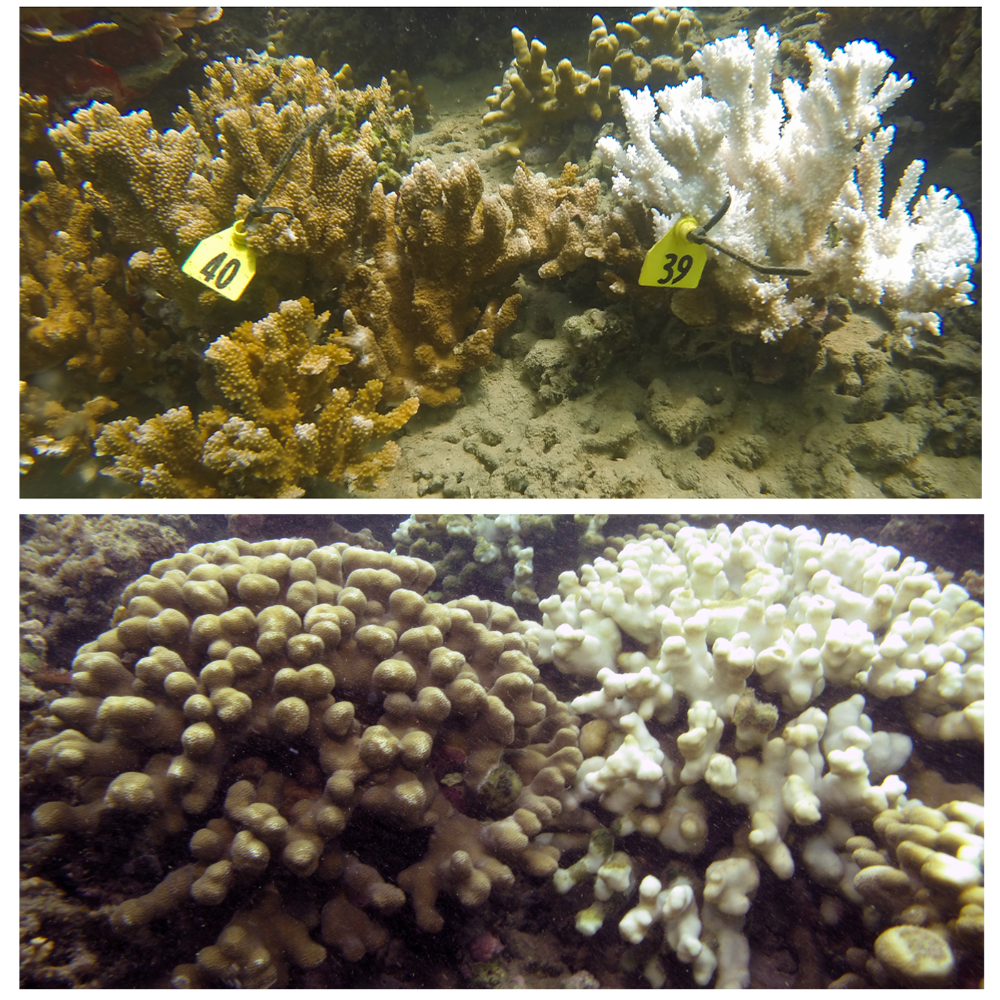

```{r setup, include = FALSE, cache = FALSE}
require("knitr")
knitr::opts_chunk$set(warning=FALSE, message=FALSE)

rm(list=ls())

library("car")
library("ggplot2")
library("lme4")
library("MASS")
library("lmerTest")
library("plyr")
library('vegan')
library("gplots")
library("plotrix")
library("psych")
library("grid")
library("gridExtra")
library("scales")
library("MuMIn")
library("lsmeans")
library("effects")
library("reshape2")
library("dplyr")
library("lubridate")
library("zoo")
library("devtools")
library("cowplot")
library("multcompView")
library("RgoogleMaps")
library("SDMTools")
library("rgdal")
library("ggmap")
library("png")
library("ecodist")
library("RVAideMemoire")
```

## Synopsis  
Ocean warming threatens coral reef ecosystems by disrupting the coral-alga symbiosis and causing coral bleaching. We examined bleaching (October 2014) and 3-months post bleaching recovery (Janurary 2015) in *Montipora capitata* and *Porites compressa* that either bleached or did not bleach during a 2014 bleaching event at three reef locations (*HIMB, Reef 25, Reef 44*) in Kāne‘ohe Bay, O‘ahu, spanning a latitudinal (north-south) gradient of oceanic input and seawater residence.  
    
We measured changes in total biomass (ash-free dry weight) and biomass composition (proteins, lipids, carbohydrates), photopigments (total chlorophylls (*a+c~2~*)), and nutritional modes as inferred from stable isotopes (δ^13^C, δ^15^N) of the coral host and its endosymbionts *Symbiodinium*.  
  
```{r Mapsetup, results="hide"}
# attach map GPS data
HI<-readOGR("data/coast_n83.shp", "coast_n83") # in meters
HI <- spTransform(HI, CRS("+proj=longlat +datum=NAD83"))

sites<-read.csv("data/environmental/Reefs_lat_long.csv", header=TRUE, na.string=NA)

# add lat, long for each site and KBay
KBay=c(21.461194,	-157.81225)
HIMB=c(21.435, -157.791083)
Reef25=c(21.461194, -157.82225)
Reef44=c(21.476778, -157.833611)
```

```{r Map fig, fig.height=3.7, fig.width=3.7, fig.align = 'center'}
# Make figure and export
#png(file= "figures/Fig1asitemap.png", height=3.5, width=3.5, units="in", res=300)
par(oma=c(3,3,0,0))

map <- GetMap(center = KBay, zoom = 13, maptype = "satellite", SCALE = 2)
PlotOnStaticMap(map, lat=sites$latitude, lon=sites$longitude, col="white", bg="coral", pch=21, cex=1.5)
TextOnStaticMap(map, lat=sites$latitude, lon=sites$longitude, labels=c("HIMB", "Reef 25", "Reef 44"), pos=4, cex=0.6, col="white", add=TRUE)
axis(1, at = LatLon2XY.centered(map, NA, c(-157.85, -157.81, -157.77))$newX, tcl=0.4, line = 0.4, col = "white", col.ticks = "black", lwd = 1, outer = TRUE, labels = c("157.85°W", "157.81°W", "157.77°W"), padj = -2.5, cex.axis = 0.6)
axis(2, at = LatLon2XY.centered(map, c(21.42, 21.46, 21.50), NA)$newY, tcl=0.4, line = 0.4, col = "white", col.ticks = "black", lwd = 1, outer = TRUE, labels = c("21.42°N", "21.46°N", "21.50°N"), padj = 0.5, hadj = 0.60, las = 1, cex.axis = 0.6)

par(new=T, mar=c(10,10,0,0))
plot(HI, xlim=c(-158.3, -157.61), ylim=c(21.27, 21.65), lwd=0.4, col="gray", bg="white")  # Oahu
rect(-157.87, 21.39, -157.71, 21.53, lwd=0.5)
box()
#dev.off()
```
**Figure 1a.** *Study site location in Kāne‘ohe Bay on the windward side of the island of O'ahu, Hawai'i*
  
  
<center>
{ width=40%} </center>
  
  
  
  
  
  
**Figure 1b-c.** Bleached and non-bleached colonies of *Montipora capitata* (top) and *Porites compressa* (bottom) during a period of thermal stress in October 2014.


  
  
## Environmental data  
Environmental data was collected at three site across the study period (October 2014 - January 2015). We continuously collected *temperature*, *light (PAR)* at each reef location at 2m depth. Twice monthly, *dissolved inorganic nutrients (DIN)* were collected at each reef, and *sedimentation* was determined during one month deployments at each reef at 2m depth, as well as a long term dataset spanning January 2015 - January 2016).  
  
  
### Light and Temp  
Temperature profiles from HIMB (Moke o Lo'e) were obtained from NOAA. Photosynthetically Active Radiation (PAR) was used to integrate light availability over a 24h d (i.e., Daily Light Integral, DLI).  Temperature recorded at each site using loggers are calcualted as daily means, maximums, and minimums. Logger failures at Reef 25 left only data for Reef 44 and HIMB.    
  
```{r Moku o Loe and logger data}
### hourly, long term data (June 2014 - Feb 2015) in Local Standard Time (LST)
### NOAA Moke o Lo'e station 1612480
### https://tidesandcurrents.noaa.gov/stationhome.html?id=1612480

setwd('data/environmental')
temp.long<-read.csv('KBay_temp_1612480_20140601-20150228_phys.csv') 

temp.long$DATE.TIME<-as.character(temp.long$DATE.TIME)
temp.long$DATE.TIME<-as.POSIXct(temp.long$DATE.TIME, format="%m/%d/%y %H:%M")
temp.long$DATE<-as.Date(temp.long$DATE.TIME, format="%m/%d/%Y")

# temp.long[which(temp.long$DATE.TIME == "2014-10-24 00:00:00"),] # at line 3481 # date of collection
# temp.long[which(temp.long$DATE.TIME == "2015-01-14 00:00:00"),] # at line 5449 # date of collection


##### Light Loggers
## Reef 44 PAR ##
light.2014<-read.csv("light_reef44_2014.csv", header=T, na.string=NA)
light.2015<-read.csv("light_reef44_2015.csv", header=T, na.string=NA)

df<-rbind(light.2014,light.2015)
df$date<-as.Date(df$date) # corrects date format
df<-df[!(df$date < "2014-12-18"),] # start at this time
df<-df[!(df$date > "2015-02-17"),] # end at this time

R44.PAR<-df

## HIMB PAR ##
light.2014<-read.csv("light_reefHIMB_2014.csv", header=T, na.string=NA)
light.2015<-read.csv("light_reefHIMB_2015.csv", header=T, na.string=NA)

df<-rbind(light.2014,light.2015)
df$date<-as.Date(df$date) # corrects date format
df<-df[!(df$date < "2014-12-18"),] #start at this time
df<-df[!(df$date > "2015-02-17"),] # end at this time
df<-df[1:5952, ] # odd NA row at row:5953, remove this 

HIMB.PAR<-df


## combine dataframes
all.PAR<-as.data.frame(c(R44.PAR[, c(1,2,4)], HIMB.PAR[4]))
colnames(all.PAR)<-c("date", "time", "PAR.R44", "PAR.HIMB")

############################
# calculate daily integrated light values for each logger
# multiply calibrated values (umol photons m-2 s-1) by 0.0864 to reach mol photons m-2 s-1
# umol/s.. /1,000,000 * 24h * 60m * 60s = 0.0864...
# since averaging over dark period here, best way is to get DLI across 24h period 

df.split <- split(all.PAR, f=all.PAR$date
                  < as.Date("2016-10-09", format="%F")) # split df by date

df.dli<-aggregate(data.frame(R44.DLI=df.split[[1]]$PAR.R44*0.0864,
                             HIMB.DLI=df.split[[1]]$PAR.HIMB*0.0864),
              by=list(date=df.split[[1]]$date), FUN=mean)


##### Temperature Loggers
## Reef 44 Temp ##
temp.2014<-read.csv("temp_reef44_2014.csv", header=T, na.string=NA)
temp.2015<-read.csv("temp_reef44_2015.csv", header=T, na.string=NA)

df<-rbind(temp.2014,temp.2015)
df$date<-as.Date(df$date) # corrects date format
df$date.time<-as.POSIXct(paste(df$date, df$time), format="%Y-%m-%d %H:%M")
df<-df[!(df$date < "2014-10-10"),] # start at this time
df<-df[!(df$date.time >"2014-11-19 13:00:00" & df$date.time < "2014-11-21 13:00:00"), ]
df<-df[!(df$date > "2015-02-17"),] # end at this time

R44.temp<-df


## HIMB  Temp ##
temp.2014<-read.csv("temp_reefHIMB_2014.csv", header=T, na.string=NA)
temp.2015<-read.csv("temp_reefHIMB_2015.csv", header=T, na.string=NA)

df<-rbind(temp.2014,temp.2015)
df$date<-as.Date(df$date) # corrects date format
df$date.time<-as.POSIXct(paste(df$date, df$time), format="%Y-%m-%d %H:%M")
df<-df[!(df$date < "2014-10-10"),] # start at this time
df<-df[!(df$date.time >"2014-11-19 13:00:00" & df$date.time < "2014-11-21 13:00:00"), ]
df<-df[!(df$date > "2015-02-17"),] # end at this time

HIMB.temp<-df

## combine dataframes
all.Temp<-as.data.frame(c(R44.temp[, c(1,2,5,4)], HIMB.temp[4]))
all.Temp<-all.Temp[-c(12386:12389),] # removing some NAs at end of dataframe
colnames(all.Temp)<-c("date", "time", "date.time", "temp.R44", "temp.HIMB")


#### temp means ####
df.split <- split(all.Temp, f=all.Temp$date
                  < as.Date("2016-10-09", format="%F")) # split df by date

df.mean<-aggregate(data.frame(R44.temp=df.split[[1]]$temp.R44,
                             HIMB.temp=df.split[[1]]$temp.HIMB),
              by=list(date=df.split[[1]]$date), FUN=mean)

df.max<-aggregate(data.frame(R44.temp=df.split[[1]]$temp.R44,
                             HIMB.temp=df.split[[1]]$temp.HIMB),
              by=list(date=df.split[[1]]$date), FUN=max)

df.min<-aggregate(data.frame(R44.temp=df.split[[1]]$temp.R44,
                             HIMB.temp=df.split[[1]]$temp.HIMB),
              by=list(date=df.split[[1]]$date), FUN=min)

```
  
  
####Figures  
```{r Fig S1. Light and Temp, fig.height=4.5, fig.width=7, results="hide"}
#### light, temp all plots #### SUPPLEMENTAL FIGURE 1

setwd('figures')
par(mar=c(2,3.6,1,1.3), mgp=c(2,0.5,0))

layout(matrix(c(1,2,3,4), nrow=2, byrow=TRUE))
k=1
## long term temperature
plot(WATERTEMP~ DATE.TIME, temp.long, type="n", ylab="Temperature (°C)", ylim=c(21, 31), yaxt="n", xaxt="n", xlab="", cex.lab=0.7, cex.axis=0.7)
     abline(h = 28.5, col = "gray60", lwd=1.2, lty=2)
     abline(v=temp.long[2761,1], col = "goldenrod", lwd=2, lty=1)
     abline(v=temp.long[4729,1], col = "goldenrod", lwd=2, lty=1)
     lines(temp.long$WATERTEMP~temp.long$DATE.TIME, lwd=.3, lty=1)
     legend("topleft", lty=1, col=c("goldenrod"), legend=c("collections"), lwd=1.5, bty="n", cex=0.8, x.intersp = 0.3)
par(new=T) # to plot dates, use code below
plot(WATERTEMP~ DATE, temp.long, type="n", ylab="", ylim=c(21, 31), xaxt="n", xlab="", cex.lab=0.7, cex.axis=0.7)
axis.Date(1, at=seq(min(temp.long$DATE), max(temp.long$DATE), by="2 month"), format="%b '%y", cex.lab=0.7, cex.axis=0.7)


############ PAR
plot(R44.DLI ~ date, df.dli, type="n", ylab=(expression(paste("DLI (mol photons", ~m^-2, ~d^-1,")"), sep="")), ylim=c(0, 35), xaxt="n", yaxt="n", xlab="Date", cex.lab=0.7, cex.axis=0.7)
axis.Date(1, at=seq(min(df.dli$date), max(df.dli$date), by="2 week"), format="%d-%b '%y", cex.lab=0.7, cex.axis=0.7)
axis(side=2, at=c(0, 10, 20, 30), cex.lab=0.7, cex.axis=0.7)
legend("topright", lty=1, col=c("dodger blue", "coral"), legend=c("Reef 44", "HIMB"), lwd=1.5, bty="n", x.intersp=0.4, y.intersp=1, cex=0.8, inset=c(0.06, 0.0))
with(na.omit(data.frame(date=df.dli$date, DLI=rollmean(df.dli$R44.DLI, k, fill=NA))), { 
  lines(date, DLI, col="dodger blue", lwd=1) 
})
with(na.omit(data.frame(date=df.dli$date, DLI=rollmean(df.dli$HIMB.DLI, k, fill=NA))), { 
  lines(date, DLI, col="coral", lwd=1)
})


#############
# plot of calibrated temp data
# mean
plot(df.mean$date, df.mean$R44.temp, type="l", col="dodger blue", xaxt="n", xlab="", ylab="Temperature (°C)", ylim=c(21, 30), cex.lab=0.7, cex.axis=0.7, lwd=1)
axis.Date(1, at=seq(min(df.mean$date), max(df.mean$date), by="3 week"), format="%d-%b '%y", cex.lab=0.7, cex.axis=0.7)
legend("topright", lty=1, col=c("dodger blue", "coral"), legend=c("Mean", " "), lwd=1.2, bty="n", x.intersp=0.3, y.intersp=0.6, cex=0.8, inset=c(0.07, 0.01))
with(df.mean, lines(df.mean$date, df.mean$HIMB.temp, col="coral", type="l", lwd=1, xlab=NA, ylab=NA, xaxt="n", yaxt="n", ylim=c(21, 31)))


############# MAX and Min Temp
plot(df.max$date, df.max$R44.temp, type="l", col="dodger blue", xaxt="n", xlab="", ylab="Temperature (°C)", ylim=c(21, 30), cex.lab=0.7, cex.axis=0.7, cex.main=0.8, lwd=1.5)
axis.Date(1, at=seq(min(df.max$date), max(df.max$date), by="3 week"), format="%d-%b '%y", cex.lab=0.7, cex.axis=0.7)
legend("topright", lty=1, lwd=c(1.7, 1.7, 0.5, 0.5), col=c("dodger blue", "coral", "dodger blue", "coral"), 
       legend=c("Max", " ", "Min", " "), 
       bty="n", x.intersp=0.2, y.intersp=1, cex=0.8, inset=c(0.05, 0.0))
with(df.max, lines(df.max$date, df.max$HIMB.temp, col="coral", type="l", lwd=1.5, xlab=NA, ylab=NA, xaxt="n", yaxt="n", ylim=c(21, 31)))
with(df.min, lines(df.min$date, df.min$R44.temp, col="dodger blue", type="l", lty=1, lwd=0.5, xlab=NA, ylab=NA, xaxt="n", yaxt="n", ylim=c(21, 31)))
with(df.min, lines(df.min$date, df.min$HIMB.temp, col="coral", type="l", lty=1, lwd=0.5, xlab=NA, ylab=NA, xaxt="n", yaxt="n", ylim=c(21, 31)))


##### save the figure and export to directory? ####
dev.copy(pdf, "Fig.S1.Temp.PAR.pdf", width=7, height=4)
dev.off()

```
**Figure S1** The temperature profile from NOAA weather station at Moku o Lo'e (HIMB) (*top left*) with coral collection (verticle lines) and local bleaching thresholds (dashed horizontal line). DLI (*top right*), and daily temperature mean (*bottom left*), and daily temperature minimum and maximum (*bottom right*).
  
  
  
### Nutrients and sedimentation
This data is from bottled samples of Kāne'ohe Bay seawater from 11 Nov 2014 - 27 Jan 2015.   
Seawater (ca. 100 ml) was taken from each site and filtered through a GF/F filter and stored in acid-washed bottles and frozen at -20 °C until analyzes.  Dissolved inorganic nutrients—ammonia (NH~3~^+^), nitrate + nitrite (NO~3~^-^ + NO~2~^-^), phosphate (PO~4~^3-^), and silicate (Si(OH)~4~)—were measured at University of Hawai‘i at Mānoa SOEST Laboratory for Analytical Biogeochemistry using a Seal Analytical AA3 HR nutrient autoanalyzer and expressed as μmol l^-1^.  
  
Rates of sedimentation at each site were measured using sediment traps (by filtered and weighing the mass of suspended particles falling into a polyvinylchloride tube (5 cm × 42 cm) capped at the base and attached to a cinder block at each reef site at a depth of 2 m. Sedimentation rates were expressed as mg sediment^-1^ d^-1^.


```{r DIN and sedimentation data, echo=FALSE}
setwd('data/environmental')

#### Nutrient data
nutrients<-read.csv("nutrients_BNB.update.csv", header=T, na.string=NA)

nutrients$Date<-mdy(nutrients$Date) # corrects date format

HIMB<-nutrients[(nutrients$Location=="HIMB"),]
Reef25<-nutrients[(nutrients$Location=="Reef 25"),]
Reef44<-nutrients[(nutrients$Location=="Reef 44"),]

plot_colors<-c("black", "gray 45", "gray75")
Reefs<-c("Reef 44", "Reef 25", "HIMB")
dates<-cbind("04-Nov '14", "18-Nov '14", "26-Nov '14", "02-Dec '14", "17-Dec '14", "23-Dec '14", "30-Dec '14", "13-Jan '15", "27-Jan '15", "04-Feb '15")


#### Short-term sedimentation data
sed<-read.csv("sediment_short_KBay.csv", header=T)

sed$Time.point<-mdy(sed$Time.point) # corrects date format
sed.HIMB<-sed[(sed$Location=="HIMB"), ]
sed.25<-sed[(sed$Location=="Reef 25"), ]
sed.44<-sed[(sed$Location=="Reef 44"), ]

dates.sed<-cbind("20-Jan '15", "17-Feb '15")


#### Annual sedimentation data 
#### This data is from a longer collection window running from collections from Jan 2015 - Jan 2016.
sed.year<-read.csv("sediment_long_KBay.csv", header=T)

# for purpose of graphing, use these dates for x-axis labels 
sed.year$fig.dates<-c("20-Jan '15", "20-Feb '15", "20-Mar '15", "20-Apr '15", "20-May '15", "20-Jun '15", "20-July '15", "20-Aug '15", "20-Sep '15", "20-Oct '15", "20-Nov '15", "20-Dec '15", "20-Jan '16")

sed.year$fig.dates<-dmy(sed.year$fig.dates) # corrects date format
sed.year$Time.point<-mdy(sed.year$Time.point) # corrects date format

sed.year.HIMB<-sed.year[(sed.year$Location=="HIMB"), ]
sed.year.25<-sed.year[(sed.year$Location=="Reef 25"), ]
sed.year.44<-sed.year[(sed.year$Location=="Reef 44"), ]

```
  
  
      
#### Figures  

```{r plot nut and sed, include=TRUE, results="hide", fig.show=TRUE, fig.height=4, fig.width=8}
#### all plots
setwd('figures')

dates<-cbind("4-Nov '14", "18-Nov '14", "26-Nov '14", "2-Dec '14", "17-Dec '14", "23-Dec '14", "30-Dec '14", "13-Jan '15", "27-Jan '15", "4-Feb '15")

par(mar=c(2,3.6,1,1.3), mgp=c(2,0.5,0))
layout(matrix(c(1,2,3,4,5,6,6,6), nrow=2, byrow=TRUE))

# Phosphate
plot(y=Reef44$Phosphate, x=Reef44$Date, xaxt="n", type="o", xlab=NA, 
     ylab=expression(paste("PO"[4]^"3-" ~(mu*mol~L^-1), sep="")), ylim=c(0, 0.25), pch=19, lty=2, cex=0.8, lwd=1, col=plot_colors[1], cex.axis=0.8) 
axis.Date(1, at=seq(min(Reef44$Date), max(Reef44$Date), by ="1 mon"), format="%b '%y", cex.lab=0.8, cex.axis=0.6) # plots Reef 44
#plots Reef 25
with(Reef44, lines(Reef25$Phosphate, x=Reef25$Date, type="o", pch=19, lty=2, cex=0.8, lwd=1, col=plot_colors[2]))
#plots HIMB
with(Reef44, lines(HIMB$Phosphate, x=HIMB$Date, type="o", pch=19, lty=2, cex=0.8, lwd=1, col=plot_colors[3]))


# Ammonium
plot(y=Reef44$Ammonia, x=Reef44$Date, xaxt="n", type="o", xlab=NA, ylab=expression(paste("NH"[4]^"+" ~(mu*mol~L^-1), sep="")), ylim=c(0, 2.5), pch=19, lty=2, cex=0.8, lwd=1, col=plot_colors[1], cex.axis=0.8)
axis.Date(1, at=seq(min(Reef44$Date), max(Reef44$Date), by ="1 mon"), format="%b '%y", cex.lab=0.8, cex.axis=0.6) #plots Reef 44
#plots Reef 25
with(Reef44, lines(Reef25$Ammonia, x=Reef25$Date, type="o", pch=19, lty=2, cex=0.8, lwd=1, col=plot_colors[2])) 
#plots HIMB
with(Reef44, lines(HIMB$Ammonia, x=HIMB$Date, type="o", pch=19, lty=2, cex=0.8, lwd=1, col=plot_colors[3]))


# Nitrate+Nitrite
plot(y=Reef44$N.N, x=Reef44$Date, xaxt="n", type="o", xlab=NA, ylab=expression(paste("NO"[3]^"-"+"NO"[2]^"-" ~(mu*mol~L^-1), sep="")), ylim=c(0, 2), pch=19, lty=2, cex=0.8, lwd=1, col=plot_colors[1], cex.axis=0.8)
axis.Date(1, at=seq(min(Reef44$Date), max(Reef44$Date), by ="1 mon"), format="%b '%y", cex.lab=0.8, cex.axis=0.6) #plots Reef 44
#plots Reef 25
with(Reef44, lines(Reef25$N.N, x=Reef25$Date, type="o", pch=19, lty=2, cex=0.8, lwd=1, col=plot_colors[2]))
#plots HIMB
with(Reef44, lines(HIMB$N.N, x=HIMB$Date, type="o", pch=19, lty=2, cex=0.8, lwd=1, col=plot_colors[3]))


# silicate
plot(y=Reef44$Silicate, x=Reef44$Date, xaxt="n", type="o", xlab=NA, ylab=expression(paste("Si(OH)"[4],~(mu*mol~L^-1), sep="")), ylim=c(0, 25), pch=19, lty=2, cex=0.8, lwd=1, col=plot_colors[1], cex.axis=0.8)
axis.Date(1, at=seq(min(Reef44$Date), max(Reef44$Date), by ="1 mon"), format="%b '%y", cex.lab=0.8, cex.axis=0.6) # plot Reef 44
# plots Reef 25
with(Reef44, lines(Reef25$Silicate, x=Reef25$Date, type="o", pch=19, lty=2, cex=0.8, lwd=1, col=plot_colors[2]))
# plots HIMB
with(Reef44, lines(HIMB$Silicate, x=HIMB$Date, type="o", pch=19, lty=2, cex=0.8, lwd=1, col=plot_colors[3]))


# 3 month sediment.
plot(y=sed.44$sedim..g.d, x=sed.44$Time.point, xaxt="n", type="o", xlab=NA, ylab=expression(paste("sediment"~(g~d^-1), sep="")), ylim=c(0, 0.1), pch=19, lty=2, cex=0.8, lwd=1, col=plot_colors[1], cex.axis=0.8)
axis(side=1, at=sed.44$Time.point, labels=dates.sed, cex.axis=0.8) #plots HIMB
#plots Reef 25
with(sed.44, lines(sed.25$sedim..g.d, x=sed.25$Time.point, type="o", pch=19, lty=2, cex=0.8, lwd=1, col=plot_colors[2]))
#plots HIMB
with(sed.44, lines(sed.HIMB$sedim..g.d, x=sed.HIMB$Time.point, type="o", pch=19, lty=2, cex=0.8, lwd=1, col=plot_colors[3]))


# year sediment
plot(y=sed.year.44$sedim..g.d, x=sed.year.44$fig.dates, xaxt="n", type="n", xlab=NA, ylab=expression(paste("sediment"~(g~d^-1), sep="")), ylim=c(0, 0.2), cex.lab=1, cex.axis=0.8)
axis.Date(1, at=seq(min(sed.year.44$fig.dates), max(sed.year.44$fig.dates), by="2 mon"), format="%b '%y", cex.lab=0.8, cex.axis=0.8)
par(new=T)
# plot Reef 44
with(sed.year.44, lines(sed.year.44$sedim..g.d, x=sed.year.44$Time.point, type="o", pch=19, lty=2, cex=0.8, lwd=1, col=plot_colors[1], cex.axis=0.8))
#plot Reef 25
with(sed.year.44, lines(sed.year.25$sedim..g.d, x=sed.year.25$Time.point, type="o", pch=19, lty=2, cex=0.8, lwd=1, col=plot_colors[2], cex.axis=0.8))
# plot HIMB
with(sed.year.44, lines(sed.year.HIMB$sedim..g.d, x=sed.year.HIMB$Time.point, type="o", pch=19, lty=2, cex=0.8, lwd=1, col=plot_colors[3], cex.axis=0.8))
legend("topleft", legend=Reefs, col=plot_colors[1:3], lwd=1, pch=19, lty=2, cex=1.1, bty="n", x.intersp=0.3, y.intersp=1.2, inset=c(0.02, 0))

##### save the figure and export to directory? ####
dev.copy(pdf, "Fig2.DIN.sed.pdf", encod="MacRoman", height=3.5, width=7)
dev.off()
```
**Figure 2** Dissolved inorganic nutrient concentrations and sedimentation rates from all sites through time.   
  
  
    
#### Models
**PO~4~^3-^ model and posthoc**   
There is a significant difference among sites, with less [PO~4~^3-^] at Reef 25 vs. Reef 44.
```{r Phosphate model}
mod.PO4<-lmer(Phosphate~Location+(1|Date), data=nutrients)
anova(mod.PO4, type=2)
posthoc<-lsmeans(mod.PO4, pairwise~Location)
cld(posthoc, Letters=letters)
# phosphate > HIMB and Reef 44, less at Reef 25
```
  
  
**NH~4~^+^ model**  
No significant effects.
```{r Ammonium model}
mod.NH4<-lmer(Ammonia~Location+(1|Date), data=nutrients)
anova(mod.NH4, type=2)
# no effect on ammonium
```
  
  
**N+N model and posthoc**  
There is a significant differences among reefs with Reef 44 having greater [N+N].
```{r N+N model}
mod.N.N<-lmer(N.N~Location+(1|Date), data=nutrients)
anova(mod.N.N, type=2)
posthoc<-lsmeans(mod.N.N, pairwise~Location)
cld(posthoc, Letters=letters)
# HIMB and Reef 25, low in N+N, Reef 44 higher
```
  
  
**H~4~SiO~4~ model**  
No significant effects.
```{r Silicate model}
mod.SiO<-lmer(Silicate~Location+(1|Date), data=nutrients)
anova(mod.SiO, type=2)
```
   
   
**Short-term sedimentation model**  
A trend for increased sedimentation through time at Reef 44 and HIMB  
```{r short term sed. model}
mod.sed<-lmer(sedim..g.d~Location+(1|Time.point), data=sed)
anova(mod.sed, type=2)
# lsmeans(mod.sed, pairwise~Location)
```
  
  
**Long-term sedimentation model and post-hoc**  

Over a longer sampling interval, there is a significant effect of Site, but a post-hoc shows this may only be a weak trend, although it is in agreement with short-term data. Overall, there is a long-term effect for 2x more sedimentation at Reef 44 and HIMB compared to Reef 25
```{r long term. sed model}
mod.sed.year<-lmer(sedim..g.d~Location+(1|Time.point), data=sed.year)
anova(mod.sed.year, type=2)
posthoc<-(lsmeans(mod.sed.year, pairwise~Location))
cld(posthoc, Letters=letters)
```
  
  
####Models  

**PAR model and post-hoc**
A statistical **difference** in DLI/PAR among two reef sites (HIMB > Reef 44); data logger lost at Reef 25. Overall, HIMB PAR (DLI) on average is 4.5 mol photons m^-2^ d^-1^ greater than Reef 44  
  
```{r PAR model}
Par.diff<-mean(df.dli$HIMB.DLI)-mean(df.dli$R44.DLI)

R44=df.dli[, 1:2]; colnames(R44)=c("Date", "PAR"); R44$Location<-"Reef 44"
HIMB=df.dli[, c(1,3)]; colnames(HIMB)=c("Date", "PAR"); HIMB$Location<-"HIMB"

PAR.mod.df<-bind_rows(R44, HIMB)

mod.PAR<-lmer(PAR~Location+(1|Date), data=PAR.mod.df)
anova(mod.PAR, type=2)

posthoc<-lsmeans(mod.PAR, pairwise~Location)
cld(posthoc, Letters=letters)

```

**Temperature model and post-hoc**  
*daily mean temperature*
```{r daily temp mean}
#### using temp means
R44=df.mean[, 1:2]; colnames(R44)=c("Date", "temp"); R44$Location<-"Reef 44"
HIMB=df.mean[, c(1,3)]; colnames(HIMB)=c("Date", "temp"); HIMB$Location<-"HIMB"

Temp.mod.mean.df<-bind_rows(R44, HIMB)

mod.mean.Temp<-lmer(temp~Location+(1|Date), data=Temp.mod.mean.df)
anova(mod.mean.Temp, type=2)

posthoc<-lsmeans(mod.mean.Temp, pairwise~Location)
cld(posthoc, Letters=letters)
```
  
*daily maximum temperature*
```{r daily temp max}
#### using temp maxs
R44=df.max[, 1:2]; colnames(R44)=c("Date", "temp"); R44$Location<-"Reef 44"
HIMB=df.max[, c(1,3)]; colnames(HIMB)=c("Date", "temp"); HIMB$Location<-"HIMB"

Temp.mod.max.df<-bind_rows(R44, HIMB)

mod.max.Temp<-lmer(temp~Location+(1|Date), data=Temp.mod.max.df)
anova(mod.max.Temp, type=2)

posthoc<-lsmeans(mod.max.Temp, pairwise~Location)
cld(posthoc, Letters=letters)
```
  
*daily minimum temperature*
```{r daily temp min}
#### using temp mins
R44=df.min[, 1:2]; colnames(R44)=c("Date", "temp"); R44$Location<-"Reef 44"
HIMB=df.min[, c(1,3)]; colnames(HIMB)=c("Date", "temp"); HIMB$Location<-"HIMB"

Temp.mod.min.df<-bind_rows(R44, HIMB)

mod.min.Temp<-lmer(temp~Location+(1|Date), data=Temp.mod.min.df)
anova(mod.min.Temp, type=2)
```
  
## Biological metrics  
Here is the data for **Three Sites** (north to south: Reef 44, Reef 25, HIMB),  **Two Periods** (October 2014 and January 2015), in two reef coral species (*Montipora capitata* and *Porites compressa*).  
  
```{r, message=FALSE, results='hide'}
# First, response variables (*physiology*) need to be normalized, as the dataframe now shows all metrics as "per milliliter of tissue slurry". Normalize the data first, then subset the dataframe for physiological response variables. Finally, a separate dataframe will be generated for isotopic data.

setwd('data')
data<-read.csv("Biological responses_BNB.final.csv", header=T, na.string=NA)

# remove columns unnecessary for final analysis
data<-data[ , !names(data) %in% "cells.ml"]


################################################
# calculate, normalized dependent variables
################################################

# helpful shorthand
SA<-data$surface.area.cm2 # surface area in cm2
blastate<-data$blastate.ml # tissue slurry blastate in ml


###############################################
### metrics of productivity and performance ###

# ug.chlorophyll.a..cm2 == ug.chl.a.ml * blastate / SA
data$chla<- (data$ug.chl.a.ml*blastate)/SA

# ug.chlorophyll.c2..cm2 == ug.chl.c2.ml * blastate / SA
data$chlc2<- (data$ug.chl.c2.ml*blastate)/SA

# total chlorophyll (a+c2)
data$chl.tot<-data$chla+data$chlc2

###########################
#### total biomass ###
# AFDW.mg..cm2 == convert AFDW g to mg, mutiply by blastate volume, divide by cm2
data$biomass<- (data$AFDW.g.ml*1000*blastate)/SA

###########################
### biomass composition ###
# the AFDW here comes from the g..AFDW of a lyophilized aliquot of tissue used in lipid extractions

# g.protein..gdw == mg.protein.ml/1000 * blastate / SA
data$prot.gdw<- (data$mg.protein.ml/1000)/(data$AFDW.freeze.ml)

# g.lipids..gdw == in this case, this is the data directly from lipid extractions of 3 ml blastate
data$lipid.gdw<- data$g.lipids.gdw

# g.carbs..gdw == mg.carbs.ml/1000 * blastate / SA
data$carb.gdw<- (data$mg.carb.ml/1000)/(data$AFDW.freeze.ml)

# kJ.energy.content..cm2 == multiply coefficents for kJ/g macromolecule (in g/gdw) and sum together
#  -23.9 kJ/g protein, 	 -17.5 kJ/g carbs,	 -39.5 kJ/g lipids       
kJ.gdw<-((data$prot.gdw)*23.9 + (data$carb.gdw)*17.5 + (data$lipid.gdw)*39.5)

data$energy.gdw<-kJ.gdw # energy.gdw

data<-data[!(data$Sample.ID=="127"),]


#### Subset dataframes ####

############# all the data: predictors, physiology normalized, isotope data
data.full<-data[, c(1:8, 33:41, 21:32)]

########## normalized physiological data in new dataframe ###############
phys.data<-data[, c(1:8, 33:41)]

############# isotopes predictors, physiology normalized, isotope data
iso.data<-data[, c(1:8, 33, 21:32)]


################################################
# Summarize dataframe to produce means, SE, and n values.
################################################

df<-phys.data # dataframe here is physiological data

#########################################
# make shorthand for response variables #
chl.tot<-df$chl.tot
biomass<-df$biomass
prot.gdw<-df$prot.gdw
lipid.gdw<-df$lipid.gdw
carb.gdw<-df$carb.gdw
energy.gdw<-df$energy.gdw

##########################################
# make shorthand for statistical effects #
Time.point<-df$Time.point
Period<-factor(df$Period, levels=c("Bleaching", "Recovery"))
Site<-factor(df$Site, levels=c("Reef 44", "Reef 25", "HIMB"))
Species<-df$Species
Condition<-df$Condition

df$Sample.ID<-as.factor(df$Sample.ID)
Sample.ID<-df$Sample.ID

df$Pair<-as.factor(df$Pair)
Pair<-df$Pair

Depth<-df$Depth.ft

df<-df[, !names(df) %in% c("chla", "chlc2")]


######################################################

# means
chl.mean<-aggregate(chl.tot~Period + Site + Species + Condition, phys.data, mean)
AFDW.mean<-aggregate(biomass~Period + Site + Species + Condition, phys.data, mean)
prot.mean<-aggregate(prot.gdw~Period + Site + Species + Condition, phys.data, mean)
lipids.mean<-aggregate(lipid.gdw~Period + Site + Species + Condition, phys.data, mean)
carbs.mean<-aggregate(carb.gdw~Period + Site + Species + Condition, phys.data, mean)
kJ.mean<-aggregate(energy.gdw~Period + Site + Species + Condition, phys.data, mean)


# SE
chl.SE<-aggregate(chl.tot~Period + Site + Species + Condition, phys.data, std.error)
AFDW.SE<-aggregate(biomass~Period + Site + Species + Condition, phys.data, std.error)
prot.SE<-aggregate(prot.gdw~Period + Site + Species + Condition, phys.data, std.error)
lipids.SE<-aggregate(lipid.gdw~Period + Site + Species + Condition, phys.data, std.error)
carbs.SE<-aggregate(carb.gdw~Period + Site + Species + Condition, phys.data, std.error)
kJ.SE<-aggregate(energy.gdw~Period + Site + Species + Condition, phys.data, std.error)

df.summary<-cbind(chl.mean, AFDW.mean[c(0,5)], prot.mean[c(0,5)], lipids.mean[c(0,5)], carbs.mean[c(0,5)], kJ.mean[c(0,5)], chl.SE[c(0,5)], AFDW.SE[c(0,5)], prot.SE[c(0,5)], lipids.SE[c(0,5)], carbs.SE[c(0,5)], kJ.SE[c(0,5)]); colnames(df.summary)= c("Period", "Site", "Species", "Condition", "chl", "AFDW", "prot", "lipids", "carbs", "kJ", "chlSE", "AFDWSE", "protSE", "lipidsSE", "carbsSE", "kJSE")


########### sample sizes ################
# means
chl.n<-aggregate(chl.tot~Period + Site + Species + Condition, phys.data, length)
AFDW.n<-aggregate(biomass~Period + Site + Species + Condition, phys.data, length)
prot.n<-aggregate(prot.gdw~Period + Site + Species + Condition, phys.data, length)
lipids.n<-aggregate(lipid.gdw~Period + Site + Species + Condition, phys.data, length)
carbs.n<-aggregate(carb.gdw~Period + Site + Species + Condition, phys.data, length)
kJ.n<-aggregate(energy.gdw~Period + Site + Species + Condition, phys.data, length)

df.sample.size<-cbind(chl.n, AFDW.n[c(0,5)], prot.n[c(0,5)], lipids.n[c(0,5)], carbs.n[c(0,5)], kJ.n[c(0,5)])

###########
# symbionts: what does the community of M. capitata, based on Cunning et al. 2016 data
Symbs<-phys.data[(phys.data$Species=="MC"),]
# table(Symbs$Period, Symbs$Condition:Symbs$symb.comm, exclude=NULL)
```

### Multivariate analysis
#### NMDS
Using metaNMDS, plot NMDS plots for each species separately. For each species, produce 4 plots: 2 plots for Bleaching (Oct 2014) and 2 plots for Recovery (Jan 2015), within each period showing Site:Condition and Condition effects. Vectors (lines) show significant univariate effects.
  
**NMDS plots for *Montipora capitata* **
```{r Montipora NMDS plots, include=TRUE, results="hide", fig.width=8, fig.height=8}
# multivariate test using adonis-- Manova, mutivariate analysis of variance
# names(data.full)
data.full[is.na(data.full$energy.gdw), ] # where are NAs? All in this column
df.manova<-data.full[!is.na(data.full$energy.gdw),] # remove rows with NA

# changed to absolute values for the MANOVA (cannot have NA or negatives)
df.manova$host.d13C<-abs(df.manova$host.d13C)
df.manova$symb.d13C<-abs(df.manova$symb.d13C)

# remove columns unnecessary for final analysis
df.manova<-df.manova[ , !names(df.manova) %in% c("prot.cm2", "AFDW.freeze", "symb.comm", "chla", "chlc2", "host.ug.N", "host.ug.C", "symb.ug.N", "symb.ug.C", "d15N.H.S", "d13C.H.S")]

Manova.data<-df.manova[, c(9:20)] # data sans factors

###################


### NMDS plot: Montipora 2014  ###
df.manova2.MC<-df.manova[(df.manova$Species=="MC" & df.manova$Period=="Bleaching"),]

NMDS<-subset(df.manova2.MC, select = c(-Time.point, -Period, -Site, -Species, -Condition, -Sample.ID, -Pair, -Depth.ft))
colnames(NMDS)<-c("chl", "biomass", "proteins", "lipids", "carbs", "kJ", "d15N-host", "d13C-host", "C:N-host", "d15N-symb", "d13C-symb", "C:N-symb")

NMDS.MC<-metaMDS(NMDS, distane='bray', k=2, trymax=100) 

# applies sqre root trans. Calculated Bray-Curtis distance
# iterations until solution reached (stress minimized after reconfiguration in dimesions = k)
# trymax = nuber of iterations, can help in non-convergence
# high stress? increase # of dimensions through 'k='

# stressplot(NMDS.MC)
# Shepard plot, scatter around regression between interpoints distance in final configuration
# (cont.) against their ordinal dissimilarities
# large scatter==original dissimilarites not well preserved in reduced # dimensions

factor.df<-df.manova2.MC[, c(2:8)]
# names(factor.df)

NMDS.df<-data.frame(x=NMDS.MC$point[,1], y=NMDS.MC$point[,2], 
                    Period=as.factor(factor.df[,1]),
                    Site=as.factor(factor.df[,2]),
                    Species=as.factor(factor.df[,3]),
                    Condition=as.factor(factor.df[,4]),
                    Sample.ID=as.factor(factor.df[,5]))

NMDS.df<-NMDS.df[, c(3:7,1,2)] # reorders columns
colnames(NMDS.df)[6:7]<-c("NMDS1", "NMDS2")

# vectors for variables
vars<-envfit(NMDS.MC, NMDS, permu=999)
#scores(vars, "vectors")


##### ##### ##### ##### ##### ##### ##### 
  ##### ##### ##### ##### ##### ##### 
# PLOTS

### "Montipora 2014---Site:Condition"
par(mfcol=c(2,2), mar=c(4,4,1,1), pty="sq")

MDS.levels<-c("R44-B", "R44-NB", "R25-B", "R25-NB", "HIMB-B", "HIMB-NB")
MDS.colors<-c("lightpink", "firebrick2", "slategray1", "dodgerblue2","khaki", "darkorange")
NMDS.mean=aggregate(NMDS.df[,6:7],list(group=NMDS.df$Site:NMDS.df$Condition), mean)
NMDS.symbols<-c(25, 25, 23, 23, 21, 21)

NMDS.plot<-ordiplot(NMDS.MC, type='n', main=substitute(paste(italic("Montipora capitata"))), cex.main=1, display="sites", xlim=c(-0.2, 0.2), ylim=c(-0.2, 0.2), cex.lab=0.8, cex.axis=0.8, xaxt='n', xlab="")
axis(side = 1, labels = FALSE, tck = -0.03)
abline(h = 0, lty = "dotted")
abline(v = 0, lty = "dotted")
text(-0.11, 0.19, "Oct '14: Bleaching", cex=1)
points(NMDS.plot, "sites", pch=NMDS.symbols, cex=1, col="black", bg=MDS.colors)
with(NMDS.plot, points(NMDS.mean[,2], NMDS.mean[,3], pch=4))
ordiellipse(NMDS.plot, groups=NMDS.df$Site:NMDS.df$Condition, draw="polygon", col=MDS.colors, label=F, alpha=150, kind="se", conf=0.95)


##### ##### ##### ##### ##### ##### ##### 
  ##### ##### ##### ##### ##### ##### 

### "Montipora 2014---Condition"
MDS.levels<-c("Bleached", "Non-bleached")
MDS.colors<-c("lightpink", "slategray1")
NMDS.mean=aggregate(NMDS.df[,6:7],list(group=NMDS.df$Condition), mean)
NMDS.symbols<-c(21, 23)

NMDS.plot<-ordiplot(NMDS.MC, type='n', display="sites", xlim=c(-0.2, 0.2), ylim=c(-0.2, 0.2), cex.lab=0.8, cex.axis=0.8, ylab="NMDS2", xlab="NMDS1")
axis(side = 1, labels = FALSE, tck = -0.03)
axis(side = 2, labels = FALSE, tck = -0.03)
abline(h = 0, lty = "dotted")
abline(v = 0, lty = "dotted")
#text(-0.25, 0.19, "b", cex=1.5)
points(NMDS.plot, "sites", pch=NMDS.symbols, cex=1, col="black", bg=MDS.colors)
with(NMDS.plot, points(NMDS.mean[,2], NMDS.mean[,3], pch=4))
ordiellipse(NMDS.plot, groups=NMDS.df$Condition, draw="polygon", col=MDS.colors, label=F, alpha=150, kind="se", conf=0.95)
par.new=T
plot(vars, p.max=0.05, cex=0.8, lwd=1)


##### ##### ##### ##### ##### ##### ##### 
  ##### ##### ##### ##### ##### ##### 


######### Montipora 2015 ########
df.manova2.MC<-df.manova[(df.manova$Species=="MC" & df.manova$Period=="Recovery"),]
NMDS<-subset(df.manova2.MC, select = c(-Time.point, -Period, -Site, -Species, -Condition, -Sample.ID, -Pair, -Depth.ft))
colnames(NMDS)<-c("chl", "biomass", "proteins", "lipids", "carbs", "kJ", "d15N-H", "d13C-H", "C:N-H", "d15N-S", "d13C-S", "C:N-S")

NMDS.MC<-metaMDS(NMDS, distane='bray', k=2, trymax=100) 
factor.df<-df.manova2.MC[, c(2:8)]; names(factor.df)

NMDS.df<-data.frame(x=NMDS.MC$point[,1], y=NMDS.MC$point[,2], 
                    Period=as.factor(factor.df[,1]),
                    Site=as.factor(factor.df[,2]),
                    Species=as.factor(factor.df[,3]),
                    Condition=as.factor(factor.df[,4]),
                    Sample.ID=as.factor(factor.df[,5]))

NMDS.df<-NMDS.df[, c(3:7,1,2)] # reorders columns
colnames(NMDS.df)[6:7]<-c("NMDS1", "NMDS2")

# vectors for variables
vars<-envfit(NMDS.MC, NMDS, permu=999)
# scores(vars, "vectors")

##### ##### ##### ##### ##### ##### ##### 
  ##### ##### ##### ##### ##### ##### 
# PLOTS

### "Montipora 2015---Site:Condition"
MDS.levels<-c("R44-B", "R44-NB", "R25-B", "R25-NB", "HIMB-B", "HIMB-NB")
MDS.colors<-c("lightpink", "firebrick2", "slategray1", "dodgerblue2","khaki", "darkorange")
NMDS.mean=aggregate(NMDS.df[,6:7],list(group=NMDS.df$Site:NMDS.df$Condition), mean)
NMDS.symbols<-c(25, 25, 23, 23, 21, 21)

NMDS.plot<-ordiplot(NMDS.MC, type='n', display="sites", xlim=c(-0.2, 0.2), ylim=c(-0.2, 0.2), cex.lab=0.8, cex.axis=0.8, xaxt='n', yaxt='n', ylab="", xlab="")
axis(side = 1, labels = FALSE, tck = -0.03)
axis(side = 2, labels = FALSE, tck = -0.03)
abline(h = 0, lty = "dotted")
abline(v = 0, lty = "dotted")
text(-0.11, 0.19, "Jan '15: Recovery", cex=1)
points(NMDS.plot, "sites", pch=NMDS.symbols, cex=1, col="black", bg=MDS.colors)
with(NMDS.plot, points(NMDS.mean[,2], NMDS.mean[,3], pch=4))
ordiellipse(NMDS.plot, groups=NMDS.df$Site:NMDS.df$Condition, draw="polygon", col=MDS.colors, label=F, alpha=150, kind="se", conf=0.95)
legend("topright", legend=MDS.levels, pch=NMDS.symbols, col="black", cex=0.85, inset=c(0.06,0), pt.bg=MDS.colors, pt.cex=1, bty="n", x.intersp = 1.2, y.intersp = 1)


##### ##### ##### ##### ##### ##### ##### 
  ##### ##### ##### ##### ##### ##### 

### "Montipora 2015---Condition"
### Condition
MDS.levels<-c("Bleached", "Non-bleached")
MDS.colors<-c("lightpink", "slategray1")
NMDS.mean=aggregate(NMDS.df[,6:7],list(group=NMDS.df$Condition), mean)
NMDS.symbols<-c(21, 23)

NMDS.plot<-ordiplot(NMDS.MC, type='n', display="sites", xlim=c(-0.2, 0.2), ylim=c(-0.2, 0.2), cex.lab=0.8, cex.axis=0.8, ylab="", yaxt='n')
axis(side = 2, labels = FALSE, tck = -0.03)
abline(h = 0, lty = "dotted")
abline(v = 0, lty = "dotted")
#text(-0.25, 0.19, "d", cex=1.5)
points(NMDS.plot, "sites", pch=NMDS.symbols, cex=1, col="black", bg=MDS.colors)
with(NMDS.plot, points(NMDS.mean[,2], NMDS.mean[,3], pch=4))
ordiellipse(NMDS.plot, groups=NMDS.df$Condition, draw="polygon", col=MDS.colors, label=F, alpha=150, kind="se", conf=0.95)
legend("topright", legend=MDS.levels, pch=NMDS.symbols, col="black", inset=c(0.18, -0.1), cex=0.9, pt.bg=MDS.colors, pt.cex=1, bty="n", x.intersp = 1, y.intersp = 1.6)
par.new=T
plot(vars, p.max=0.05, cex=0.8, lwd=1)

##### save the figure and export to directory? ####
#dev.copy(pdf, "figures/Fig3.NMDS_MC.pdf", height=7, width=8, useDingbats=FALSE)
#dev.off() 
##### 
```

**NMDS plots for *Porites compressa* ** 

```{r Porites NMDS, include=TRUE, results="hide", fig.width=8, fig.height=8}
##### ##### ##### ##### ##### ##### ##### 
  ##### ##### ##### ##### ##### #####
df.manova2.PC<-df.manova[(df.manova$Species=="PC" & df.manova$Period=="Bleaching"),]

NMDS<-subset(df.manova2.PC, select = c(-Time.point, -Period, -Site, -Species, -Condition, -Sample.ID, -Pair, -Depth.ft))
colnames(NMDS)<-c("chl", "biomass", "proteins", "lipids", "carbs", "kJ", "d15N-H", "d13C-H", "C:N-H", "d15N-S", "d13C-S", "C:N-S")

NMDS.PC<-metaMDS(NMDS, distance='bray', k=2, trymax=100) 
# stressplot(NMDS.PC)
# plot(NMDS.PC, type='t') 

species.scores <- as.data.frame(scores(NMDS.PC, "species")) # extracts 'species' scores
species.scores$species <- rownames(species.scores) #creates a 'species columns' = this is the variables

factor.df<-df.manova2.PC[, c(2:8)]; names(factor.df)

NMDS.df<-data.frame(x=NMDS.PC$point[,1], y=NMDS.PC$point[,2], 
                    Period=as.factor(factor.df[,1]),
                    Site=as.factor(factor.df[,2]),
                    Species=as.factor(factor.df[,3]),
                    Condition=as.factor(factor.df[,4]),
                    Sample.ID=as.factor(factor.df[,5]))

NMDS.df<-NMDS.df[, c(3:7,1,2)] # reorders columns
colnames(NMDS.df)[6:7]<-c("NMDS1", "NMDS2")

MDS.levels<-c("R44-B", "R44-NB", "R25-B", "R25-NB", "HIMB-B", "HIMB-NB")
MDS.colors<-c("lightpink", "firebrick2", "slategray1", "dodgerblue2","khaki", "darkorange")
NMDS.mean=aggregate(NMDS.df[,6:7],list(group=NMDS.df$Site:NMDS.df$Condition), mean)

# vectors for variables
vars<-envfit(NMDS.PC, NMDS, permu=999)
#scores(vars, "vectors")


###################


# PLOTS
### Porites 2014-- Site:Condition
par(mfcol=c(2,2), mar=c(4,4,1,1), pty="sq")

NMDS.plot<-ordiplot(NMDS.PC, type='n', main=substitute(paste(italic("Porites compressa"))), cex.main=1, display="sites", xlim=c(-0.12, 0.12), ylim=c(-0.12, 0.12), cex.lab=0.8, cex.axis=0.8, xaxt='n', xlab="")
axis(side = 1, labels = FALSE, tck = -0.03)
abline(h = 0, lty = "dotted")
abline(v = 0, lty = "dotted")
text(-0.066, 0.114, "Oct '14: Bleaching", cex=1)
points(NMDS.plot, "sites", pch=NMDS.symbols, cex=1, col="black", bg=MDS.colors)
with(NMDS.plot, points(NMDS.mean[,2], NMDS.mean[,3], pch=4))
ordiellipse(NMDS.plot, groups=NMDS.df$Site:NMDS.df$Condition, draw="polygon", col=MDS.colors, label=F, alpha=150, kind="se", conf=0.95)


##### ##### ##### ##### ##### ##### ##### 
  ##### ##### ##### ##### ##### #####

### Porites 2014-- Condition
MDS.levels<-c("Bleached", "Nonbleached")
MDS.colors<-c("lightpink", "slategray1")
NMDS.mean=aggregate(NMDS.df[,6:7],list(group=NMDS.df$Condition), mean)
NMDS.symbols<-c(21, 23)  

NMDS.plot<-ordiplot(NMDS.PC, type='n', display="sites", xlim=c(-0.12, 0.12), ylim=c(-0.12, 0.12), cex.lab=0.8, cex.axis=0.8, ylab= "NMDS2", xlab="NMDS1")
axis(side = 1, labels = FALSE, tck = -0.03)
axis(side = 2, labels = FALSE, tck = -0.03)
abline(h = 0, lty = "dotted")
abline(v = 0, lty = "dotted")
points(NMDS.plot, "sites", pch=NMDS.symbols, cex=1, col="black", bg=MDS.colors)
with(NMDS.plot, points(NMDS.mean[,2], NMDS.mean[,3], pch=4))
ordiellipse(NMDS.plot, groups=NMDS.df$Condition, draw="polygon", col=MDS.colors, label=F, alpha=150, kind="se", conf=0.95)
par.new=T
plot(vars, p.max=0.05, cex=0.8, lwd=1)


##### ##### ##### ##### ##### ##### ##### 
  ##### ##### ##### ##### ##### #####

### Porites 2015 ###
df.manova2.PC<-df.manova[(df.manova$Species=="PC" & df.manova$Period=="Recovery"),]

NMDS<-subset(df.manova2.PC, select = c(-Time.point, -Period, -Site, -Species, -Condition, -Sample.ID, -Pair, -Depth.ft))
colnames(NMDS)<-c("chl", "biomass", "protein", "lipids", "carbs", "kJ", "d15N-host", "d13C-host", "C:N-host", "d15N-symb", "d13C-symb", "C:N-symb")

NMDS.PC<-metaMDS(NMDS, distane='bray', k=2, trymax=100) 
# stressplot(NMDS.PC)
# plot(NMDS.PC, type='t') 

species.scores <- as.data.frame(scores(NMDS.PC, "species")) # extracts 'species' scores
species.scores$species <- rownames(species.scores) #creates a 'species columns' = this is the variables

factor.df<-df.manova2.PC[, c(2:8)]; names(factor.df)

NMDS.df<-data.frame(x=NMDS.PC$point[,1], y=NMDS.PC$point[,2], 
                    Period=as.factor(factor.df[,1]),
                    Site=as.factor(factor.df[,2]),
                    Species=as.factor(factor.df[,3]),
                    Condition=as.factor(factor.df[,4]),
                    Sample.ID=as.factor(factor.df[,5]))

NMDS.df<-NMDS.df[, c(3:7,1,2)] # reorders columns
colnames(NMDS.df)[6:7]<-c("NMDS1", "NMDS2")


MDS.levels<-c("R44-B", "R44-NB", "R25-B", "R25-NB", "HIMB-B", "HIMB-NB")
MDS.colors<-c("lightpink", "firebrick2", "slategray1", "dodgerblue2","khaki", "darkorange")
NMDS.mean=aggregate(NMDS.df[,6:7],list(group=NMDS.df$Site:NMDS.df$Condition), mean)
NMDS.symbols<-c(25, 25, 23, 23, 21, 21)

# vectors for variables
vars<-envfit(NMDS.PC, NMDS, permu=999)
# scores(vars, "vectors")


##### ##### ##### ##### ##### ##### ##### 
  ##### ##### ##### ##### ##### #####

### "Porites 2015---Site:Condition"
NMDS.plot<-ordiplot(NMDS.PC, type='n', display="sites", xlim=c(-0.12, 0.12), ylim=c(-0.12, 0.12), cex.lab=0.8, cex.axis=0.8, ylab="", xlab="", xaxt="n", yaxt="n")
axis(side = 1, labels = FALSE, tck = -0.03)
axis(side = 2, labels = FALSE, tck = -0.03)
abline(h = 0, lty = "dotted")
abline(v = 0, lty = "dotted")
text(-0.066, 0.114, "Jan '15: Recovery", cex=1)
points(NMDS.plot, "sites", pch=NMDS.symbols, cex=1, col="black", bg=MDS.colors)
with(NMDS.plot, points(NMDS.mean[,2], NMDS.mean[,3], pch=4))
ordiellipse(NMDS.plot, groups=NMDS.df$Site:NMDS.df$Condition, draw="polygon", col=MDS.colors, label=F, alpha=150, kind="se", conf=0.95)
legend("topright", legend=MDS.levels, pch=NMDS.symbols, col="black", cex=0.85, inset=c(0.06,0), pt.bg=MDS.colors, pt.cex=1, bty="n", x.intersp = 1.2, y.intersp = 1)


##### ##### ##### ##### ##### ##### ##### 
  ##### ##### ##### ##### ##### #####

### "Porites 2015---Condition"
MDS.levels<-c("Bleached", "Non-bleached")
MDS.colors<-c("lightpink", "slategray1")
NMDS.mean=aggregate(NMDS.df[,6:7],list(group=NMDS.df$Condition), mean)
NMDS.symbols<-c(21, 23)

NMDS.plot<-ordiplot(NMDS.PC, type='n', display="sites", xlim=c(-0.12, 0.12), ylim=c(-0.12, 0.12), cex.lab=0.8, cex.axis=0.8, ylab="", yaxt='n')
axis(side = 2, labels = FALSE, tck = -0.03)
abline(h = 0, lty = "dotted")
abline(v = 0, lty = "dotted")
#text(-0.15, 0.11, "d", cex=1.5)
points(NMDS.plot, "sites", pch=NMDS.symbols, cex=1, col="black", bg=MDS.colors)
with(NMDS.plot, points(NMDS.mean[,2], NMDS.mean[,3], pch=4))
ordiellipse(NMDS.plot, groups=NMDS.df$Condition, draw="polygon", col=MDS.colors, label=F, alpha=150, kind="se", conf=0.95)
legend("topright", legend=MDS.levels, pch=NMDS.symbols, col="black", inset=c(0.18, -0.1), cex=0.9, pt.bg=MDS.colors, pt.cex=1, bty="n", x.intersp = 1, y.intersp = 1.6)
par.new=T
plot(vars, p.max=0.05, cex=0.8, lwd=1)

##### save the figure and export to directory? ####
#dev.copy(pdf, "figures/Fig4.NMDS_PC.pdf", height=7, width=8, useDingbats=FALSE)
#dev.off()
##### 
```

#### MANOVA  

**MANOVA outputs**
These outputs from MANOVA cane be found in **Table S3**.
  
The *first MANOVA* shows *Montipora capitata* 
```{r}
# Species sufficently distinct (NMDS shows this), run MANOVA with Species separated

# from above---df.manova2.MC is the df with Montipora alone
MC.Manova<-df.manova[(df.manova$Species=="MC"),]
MC.Manova.data<-MC.Manova[, c(9:20)] # makes df without factor columns

# from above---df.manova2.PC is the df with Porites alone
PC.Manova<-df.manova[(df.manova$Species=="PC"),]
PC.Manova.data<-PC.Manova[, c(9:20)] # makes df without factor columns


#### #### #### #### #### #### 
  #### #### #### #### #### ####

#### Montipora
MVA.MC<-adonis2(MC.Manova.data~Period*Site*Condition, data=MC.Manova,permutations=1000, 
                method="bray", sqrt.dist = TRUE)
MVA.MC # effect of  Period > Condition > Site and Period:Condition

# posthocs
MC.bray=vegdist(MC.Manova.data) #matrix as a distance matrix
# pairwise.perm.manova(MC.bray, MC.Manova$Period, nperm=1000, p.method="holm") # Periods differ (p=0.001)
# pairwise.perm.manova(MC.bray, MC.Manova$Site, nperm=1000, p.method="holm") # Sites not different (p>0.11)
# pairwise.perm.manova(MC.bray, MC.Manova$Condition, nperm=1000, p.method="holm") # not different (p=0.083)
# pairwise.perm.manova(MC.bray, MC.Manova$Period:MC.Manova$Condition, nperm=1000, p.method="holm")

# @ bleaching--bleached corals different from non-bleached
# @ recovery--bleached corals not different fron non-bleached (p=0.305)


#### #### #### #### #### #### 
  #### #### #### #### #### #### 
```

The *second MANOVA* shows *Porites compressa*
```{r PC NMDS}

#### Porites
MVA.PC<-adonis2(PC.Manova.data~Period*Site*Condition, data=PC.Manova, permutations=1000, 
                method="bray", sqrt.dist = TRUE)
MVA.PC # effect of Period > Condition > Period:Condition

# posthocs
PC.bray=bcdist(PC.Manova.data) #matrix as a distance matrix
# pairwise.perm.manova(PC.bray, PC.Manova$Period, nperm=1000, p.method="holm") # different (p=0.001)
# pairwise.perm.manova(PC.bray, PC.Manova$Condition, nperm=1000, p.method="holm") # different (p=0.005)
# pairwise.perm.manova(PC.bray, PC.Manova$Period:PC.Manova$Condition, nperm=1000, p.method="holm")
# @ bleaching--bleached corals different from non-bleached
# @ recovery--bleached corals not different fron non-bleached (p=0.110)

```


### Univariate analysis
**separate models by species**
Here, each response variable is now analyzed in a linear mixed effect model. For each response variable model selection is performed as follows:  
  
- *Divide the species*  The NMDS showed species were distinct, dividing the species can allow for univariate tests to look at the species-specifc responses more clearly. 
  
- *Using LMER*  First, check for valid assumptions of ANVOA and normal distribution using graphical inspections of residuals and QQ plots.  
  
Linear mixed effect models are run with all fixed effects (*Period, Site, Condition*) and the repeated sampling of individuals is accounted for using coral ID (*Sample ID*) and colony pairs (*Pairs*) as a random effects. This model is labeled as: **full.test**. This model is fit with *restricted maximum likelihood (REML)*. Inspect the output and identify interactive effects that can be dropped. Next, compare models with different fixed effect.  
  
- *Model Selection* After fitting the first model (*full*), compare to a reduced model where non-significant interactive terms have been dropped. This model is labeled: **add**. To compare models, the full model must be refit using maximum likelihood, set by *REML=FALSE*, in order to compare models with different fixed effects. This re-fit ML-model-- for comparison only-- is called: **full**.  With both models fit by maximum likelihood, use likelihood ratio tests and compare the two models and see if there is reduced model (e.g., *add*) differs from full model. If not (P> 0.15, since chi-square is usually inflated), drop non-significant effects and proceed with the best model.  
  
- *Fit Final Model*  Run the best model with end tag **xxx.mod.FINAL**, *fit with REML*, generate ANVOA table (Type II SS), and run posthoc test (lsmeans) where necessary. Posthoc tests should be run  as 'slices', where a comparison is made among groups and primary effects tested.  
  
Output from these models can be found summarized in **Tables 1, S4 (MC physiology), S5 (PC physiology)**.
  
  
#### *Montipora capitata*
Code will  test for assumptions of ANOVA. Where assumptions are not met, data transformations are applied, with help selecting an appropriate transformation aided with a Box-Cox test. A loop generates diagnostic plots (QQ plots, histogram of residuals) and tests metrics for adherence to ANOVA assumptions.  

```{r, results='hide', fig.show='hide', echo=FALSE}
# df -- original untransformed data

#### MC data only from here
phys.datatests.MC<-df[(df$Species=="MC"),] # raw data all MC

# Boxcox transformations
# boxcox(Y~Period+Site+Condition, data=phys.datatests.MC, lambda=seq(-1, 2, length=10))

## tests for MC
for(i in c(10:15)){
  Y<-phys.datatests.MC[,i]
  full<-lmer(Y~Period*Site*Condition+(1|Sample.ID)+(1|Pair), data=phys.datatests.MC,  na.action=na.exclude)
  R <- resid(full) #save glm residuals
  Y.shapiro <- shapiro.test(R) #runs a normality test on residuals
  print(Y.shapiro) # null = normally distrubuted (P<0.05 = non-normal
  
  op<-par(mfrow = c(2,2), mar=c(5,4,1,2), pty="sq")
  plot(full, add.smooth = FALSE, which=1)
  QQ <- qqnorm(R, main = colnames(phys.datatests.MC)[i]) 
  QQline <- qqline(R)
  hist(R, xlab="Residuals", main = colnames(phys.datatests.MC)[i])
}

# transformations
phys.datatests.MC$carb.gdw<-(phys.datatests.MC$carb.gdw)^0.25 #carbs

# adjust names
colnames(phys.datatests.MC)<-c("Time.point", "Period", "Site", "Species", "Condition", "Sample.ID", "Pair", "Depth.ft", "symb.comm", "chl", "biomass", "prot", "lipid", "carb", "kJ")

```
**Linear Mixed Effect Models**  
  
  
**Total chlorophyll (ug cm^-2^)**
```{r MC chlorophyll, results='hide'}
###################
# chl a+c2
################### 
full.test<-lmer(chl~Period*Site*Condition+(1|Sample.ID)+(1|Pair), data=phys.datatests.MC,  na.action=na.exclude)
anova(full.test, type=2) # only slight effect of Site

#### compare models ####
# full model
full<-lmer(chl~Period*Site*Condition+(1|Sample.ID)+(1|Pair), REML=FALSE, data=phys.datatests.MC,  na.action=na.exclude)

# additive model
add<-lmer(chl~Period+Site+Condition+Period:Condition+(1|Sample.ID)+(1|Pair), REML=FALSE, data=phys.datatests.MC,  na.action=na.exclude)

anova(full, add) # no difference
```

```{r MC chlorophyll final, fig.height=3, fig.width=8}
# final model
Chl.mod.FINAL<-lmer(chl~Period+Site+Condition+Period:Condition+(1|Sample.ID)+(1|Pair), data=phys.datatests.MC,  na.action=na.exclude)

# ANOVA table
anova(Chl.mod.FINAL, type=2)
posthoc<-lsmeans(Chl.mod.FINAL, pairwise~Condition|Period)
cld(posthoc, Letters=letters)

plot(allEffects(Chl.mod.FINAL), ylab="total chlorophyll ug/cm2")

# Bleaching: B and NB  differ (a vs. b)
# Recovery: B and NB do not differ (a vs. a)
```

**Total biomass (AFDW mg cm^-2^)**
```{r MC biomass, results='hide', fig.show='hide'}
###################
# AFDW biomass
###################
full.test<-lmer(biomass~Period*Site*Condition+(1|Sample.ID)+(1|Pair), data=phys.datatests.MC,  na.action=na.exclude)
anova(full.test, type=2) # only slight effect of Site

#### compare models ####
# full model
full<-lmer(biomass~Period*Site*Condition+(1|Sample.ID)+(1|Pair), REML=FALSE, data=phys.datatests.MC,  na.action=na.exclude)

# additive model
add<-lmer(biomass~Period+Site+Condition+Period:Condition+(1|Sample.ID)+(1|Pair), REML=FALSE, data=phys.datatests.MC,  na.action=na.exclude)

anova(full, add) # no difference
```

```{r MC biomass final, fig.height=3, fig.width=8}
# final model
AFDW.mod.FINAL<-lmer(biomass~Period+Site+Condition+Period:Condition+(1|Sample.ID)+(1|Pair), data=phys.datatests.MC,  na.action=na.exclude)
# rand(AFDW.mod.FINAL)

# ANOVA table
print(anova(AFDW.mod.FINAL, type=2), digits=6)
posthoc<-lsmeans(AFDW.mod.FINAL, pairwise~Condition|Period)


cld(posthoc, Letters=letters); 
# Bleaching period: B < NB (a vs. b)
# Recovery period: B = NB (a vs a)

plot(allEffects(AFDW.mod.FINAL), ylab="M. capitata AFDW mg/cm2")
```

**Protein (g gdw^-1^)**
```{r MC protein, results='hide', fig.show='hide'}
###################
# prot.gdw
################### 
full.test<-lmer(prot~Period*Site*Condition+(1|Sample.ID)+(1|Pair), data=phys.datatests.MC,  na.action=na.exclude)
anova(full.test, type=2) # only effect of Period

#### compare models ####
# full model
full<-lmer(prot~Period*Site*Condition+(1|Sample.ID)+(1|Pair), REML=FALSE, data=phys.datatests.MC,  na.action=na.exclude)

# additive model
add<-lmer(prot~Period+Site+Condition+(1|Sample.ID)+(1|Pair), REML=FALSE, data=phys.datatests.MC,  na.action=na.exclude)

anova(full, add) # no difference
```

```{r MC protein, final, fig.height=6, fig.width=8}
# final model
Prot.gdw.mod.FINAL<-lmer(prot~Period+Site+Condition+(1|Sample.ID)+(1|Pair), data=phys.datatests.MC,  na.action=na.exclude)

# ANOVA table
anova(Prot.gdw.mod.FINAL, type=2)
# rand(Prot.gdw.mod.FINAL)

posthoc<-lsmeans(Prot.gdw.mod.FINAL, pairwise~Period)
cld(posthoc, Letters=letters);

plot(allEffects(Prot.gdw.mod.FINAL), ylab="M. capitata protein/gdw")
```

**Lipids (mg gdw^-1^)**
```{r MC lipids, results='hide', fig.show='hide'}
###################
# lip.gdw
################### 
full.test<-lmer(lipid~Period*Site*Condition+(1|Sample.ID)+(1|Pair), data=phys.datatests.MC,  na.action=na.exclude)
anova(full.test, type=2) # only slight effect of Site

#### compare models ####
# full model
full<-lmer(lipid~Period*Site*Condition+(1|Sample.ID)+(1|Pair), REML=FALSE, data=phys.datatests.MC,  na.action=na.exclude)

# additive model
add<-lmer(lipid~Period+Site+Condition+(1|Sample.ID)+(1|Pair), REML=FALSE, data=phys.datatests.MC,  na.action=na.exclude)

anova(full, add) # no difference
```

```{r MC lipids final, fig.height=6, fig.width=8}
# final model
Lipid.gdw.mod.FINAL<-lmer(lipid~Period+Site+Condition+(1|Sample.ID)+(1|Pair), data=phys.datatests.MC,  na.action=na.exclude)

# ANOVA table
anova(Lipid.gdw.mod.FINAL, type=2)
# rand(Lipid.gdw.mod.FINAL)

plot(allEffects(Lipid.gdw.mod.FINAL), ylab="M. capitata lipids/gdw")
```

**Carbohydrates (g gdw^-1^)**
```{r MC carbs, results='hide', fig.show='hide'}
###################
# carb.gdw
################### 
# full model
full.test<-lmer(carb~Period*Site*Condition+(1|Sample.ID)+(1|Pair), data=phys.datatests.MC,  na.action=na.exclude)
anova(full.test, type=2) # only slight effect of Period

#### compare models ####
# full model
full<-lmer(carb~Period*Site*Condition+(1|Sample.ID)+(1|Pair), REML=FALSE, data=phys.datatests.MC,  na.action=na.exclude)

# additive model
add<-lmer(carb~Period+Site+Condition+(1|Sample.ID)+(1|Pair), REML=FALSE, data=phys.datatests.MC,  na.action=na.exclude)

anova(full, add) # no difference
```

```{r MC carbsfinal, fig.height=6, fig.width=8}
# final model
Carbs.gdw.mod.FINAL<-lmer(carb~Period+Site+Condition+(1|Sample.ID)+(1|Pair), data=phys.datatests.MC,  na.action=na.exclude)

# ANOVA table
anova(Carbs.gdw.mod.FINAL, type=2)
# rand(Carbs.gdw.mod.FINAL)

plot(allEffects(Carbs.gdw.mod.FINAL), ylab="M. capitata carbs/gdw")
```

**Biomass Kilojoule (kJ gdw^-1^)**
```{r MC kJ, results='hide', fig.show='hide'}
###################
# kJ.gdw
###################  
full.test<-lmer(kJ~Period*Site*Condition+(1|Sample.ID)+(1|Pair), data=phys.datatests.MC,  na.action=na.exclude)
anova(full.test, type=2) # only slight effect of Site

#### compare models ####
# full model
full<-lmer(kJ~Period*Site*Condition+(1|Sample.ID)+(1|Pair), REML=FALSE, data=phys.datatests.MC,  na.action=na.exclude)

# additive model
add<-lmer(kJ~Period+Site+Condition+(1|Sample.ID)+(1|Pair), REML=FALSE, data=phys.datatests.MC,  na.action=na.exclude)

anova(full, add) # no difference
```

```{r MC kJ final, fig.height=6, fig.width=8}
# final model
kJ.gdw.mod.FINAL<-lmer(kJ~Period+Site+Condition+(1|Sample.ID)+(1|Pair), data=phys.datatests.MC,  na.action=na.exclude)

# ANOVA table
anova(kJ.gdw.mod.FINAL, type=2)
# rand(kJ.gdw.mod.FINAL)

plot(allEffects(kJ.gdw.mod.FINAL), ylab="M. capitata kJ/gdw")

```
  
  
#### Porites compressa  
```{r PC diagnostic, results='hide', fig.show='hide', echo=FALSE}
# Diagnostic plots and transformations, same as above.

#### PC data only from here
phys.datatests.PC<-df[(df$Species=="PC"),] # raw data all MC

## tests for PC
for(i in c(10:15)){
  Y<-phys.datatests.PC[,i]
  full<-lmer(Y~Period*Site*Condition+(1|Sample.ID)+(1|Pair), data=phys.datatests.PC,  na.action=na.exclude)
  R <- resid(full) #save glm residuals
  Y.shapiro <- shapiro.test(R) #runs a normality test on residuals
  print(Y.shapiro) # null = normally distrubuted (P<0.05 = non-normal
  
  op<-par(mfrow = c(2,2), mar=c(5,4,1,2), pty="sq")
  plot(full, add.smooth = FALSE, which=1)
  QQ <- qqnorm(R, main = colnames(phys.datatests.PC)[i]) 
  QQline <- qqline(R)
  hist(R, xlab="Residuals", main = colnames(phys.datatests.PC)[i])
}


# adjust names
colnames(phys.datatests.PC)<-c("Time.point", "Period", "Site", "Species", "Condition", "Sample.ID", "Pair", "Depth.ft", "symb.comm", "chl", "biomass", "prot", "lipid", "carb", "kJ")
```
**Linear Mixed Effect Models**  
    
**Chlorophylls (ug cm^-2^)**
```{r PC chlorophylls, results='hide', fig.show='hide'}
###################
#chl a+c2
################### SITE RETAINED-- Period, Condition, Period:Condition effect, almost a Site effect
# full model
full<-lmer(chl~Period*Site*Condition+(1|Sample.ID)+(1|Pair), data=phys.datatests.PC,  na.action=na.exclude)
anova(full, type=2) # lots of effects, use full model
```

```{r PC chlorophylls final, fig.height=3, fig.width=8}
# final model
PC.tot.chl.mod.FINAL<-lmer(chl~Period*Site*Condition+(1|Sample.ID)+(1|Pair), data=phys.datatests.PC,  na.action=na.exclude)

# ANOVA table
print(anova(PC.tot.chl.mod.FINAL, type=2), digits =6)
# rand(PC.tot.chl.mod.FINAL)

posthoc<-lsmeans(PC.tot.chl.mod.FINAL, pairwise~Condition|Period:Site)
cld(posthoc, Letters=letters)

posthoc<-lsmeans(PC.tot.chl.mod.FINAL, pairwise~Condition|Site)
cld(posthoc, Letters=letters)

plot(allEffects(PC.tot.chl.mod.FINAL), ylab="P. compressa chl ug/cm2")

```

**Total biomass (AFDW mg cm^-2^)**
```{r PC biomass, results='hide', fig.show='hide'}
###################
# AFDW biomass
################### 
# full model
full.test<-lmer(biomass~Period*Site*Condition+(1|Sample.ID)+(1|Pair), data=phys.datatests.PC,  na.action=na.exclude)
anova(full, type=2) # only Condition effect, drop interactions

#### compare models ####
full<-lmer(biomass~Period*Site*Condition+(1|Sample.ID)+(1|Pair), REML=FALSE, data=phys.datatests.PC,  na.action=na.exclude)

# additive model
add<-lmer(biomass~Period+Site+Condition+(1|Sample.ID)+(1|Pair), REML=FALSE, data=phys.datatests.PC,  na.action=na.exclude)

# compare models
AIC(full, add)
anova(full, add) # no difference in effects
```

```{r PC biomass final, fig.height=6, fig.width=8}
# final model
PC.AFDW.mod<-lmer(biomass~Period+Site+Condition+(1|Sample.ID)+(1|Pair), data=phys.datatests.PC,  na.action=na.exclude)

# ANOVA table
print(anova(PC.AFDW.mod, type=2), digits=6)
# rand(PC.AFDW.mod)

posthoc<-lsmeans(PC.AFDW.mod, pairwise~Condition|Period)
cld(posthoc, Letters=letters)
# @ Bleaching: B < NB, but @ Recovery B = NB

plot(allEffects(PC.AFDW.mod), ylab="P. compressa AFDW mg/cm2")
```


**Protein (g gdw^-1^)**
```{r, results='hide', fig.show='hide'}
###################
# prot.gdw
################### 
full.test<-lmer(prot~Period*Site*Condition+(1|Sample.ID)+(1|Pair), data=phys.datatests.PC,  na.action=na.exclude)
anova(full.test, type=2) # only Period:Condition effect

#### compare models ####
# full model
full<-lmer(prot~Period*Site*Condition+(1|Sample.ID)+(1|Pair), REML=FALSE, data=phys.datatests.PC,  na.action=na.exclude)

# additive model
add<-lmer(prot~Period+Site+Condition+Period:Condition+(1|Sample.ID)+(1|Pair), REML=FALSE, data=phys.datatests.PC,  na.action=na.exclude)

anova(full, add) # no difference
```

```{r PC prot model final, fig.height=3, fig.width=8}
# final model
PC.prot.mod.FINAL<-lmer(prot~Period+Site+Condition+Period:Condition+(1|Sample.ID)+(1|Pair), data=phys.datatests.PC,  na.action=na.exclude)

# ANOVA table
anova(PC.prot.mod.FINAL, type=2)
# rand(PC.prot.mod.FINAL)

posthoc<-lsmeans(PC.prot.mod.FINAL, pairwise~Condition|Period)
cld(posthoc, Letters=letters)

plot(allEffects(PC.prot.mod.FINAL), ylab="P. compressa protein/gdw")

```

**Lipids (g gdw^-1^)**
```{r, results='hide', fig.show='hide', fig.height=3, fig.width=8}
###################
# lip.gdw
################### 
full.test<-lmer(lipid~Period*Site*Condition+(1|Sample.ID)+(1|Pair), data=phys.datatests.PC,  na.action=na.exclude)
anova(full, type=2) # only Period, Period:Site effects, drop interactions

#### compare models ####
# full model
full<-lmer(lipid~Period*Site*Condition+(1|Sample.ID)+(1|Pair), REML=FALSE, data=phys.datatests.PC,  na.action=na.exclude)

# additive model
add<-lmer(lipid~Period+Site+Condition+Period:Site+(1|Sample.ID)+(1|Pair), REML=FALSE, data=phys.datatests.PC,  na.action=na.exclude)

anova(full, add) # no difference
```

```{r PC lipid model final, fig.height=3, fig.width=8}
# final model
PC.lipids.mod.FINAL<-lmer(lipid~Period+Site+Condition+Period:Site+(1|Sample.ID)+(1|Pair), data=phys.datatests.PC,  na.action=na.exclude)

# ANOVA table
anova(PC.lipids.mod.FINAL, type=2)
# rand(PC.lipids.mod.FINAL)

posthoc<-lsmeans(PC.lipids.mod.FINAL, pairwise~Site|Period)
cld(posthoc, Letters=letters)

plot(allEffects(PC.lipids.mod.FINAL), ylab="P. compressa lipids/gdw")

```

**Carbohydrates (g gdw^-1^)**
```{r, results='hide', fig.show='hide'}
###################
# carb.gdw
################### 
full.test<-lmer(carb~Period*Site*Condition+(1|Sample.ID)+(1|Pair), data=phys.datatests.PC,  na.action=na.exclude)
anova(full.test) # no effects

#### compare models ####
# full model
full<-lmer(carb~Period*Site*Condition+(1|Sample.ID)+(1|Pair), REML=FALSE, data=phys.datatests.PC,  na.action=na.exclude)

# additive model
add<-lmer(carb~Period+Site+Condition+Period:Site+(1|Sample.ID)+(1|Pair), REML=FALSE, data=phys.datatests.PC,  na.action=na.exclude)

anova(full, add) # no difference
```

```{r, message=FALSE, fig.height=6, fig.width=8}
# final model
PC.carb.mod.FINAL<-lmer(carb~Period+Site+Condition+(1|Sample.ID)+(1|Pair), data=phys.datatests.PC,  na.action=na.exclude)

# ANOVA table
anova(PC.carb.mod.FINAL, type=2)
# rand(PC.carb.mod.FINAL)

plot(allEffects(PC.carb.mod.FINAL), ylab="P. compressa carbs/gdw")

```

**Biomass kilojoule (kJ gdw^-1^)**
```{r, results='hide', fig.show='hide'}
###################
# kJ.gdw
################### 
full.test<-lmer(kJ~Period*Site*Condition+(1|Sample.ID)+(1|Pair), data=phys.datatests.PC,  na.action=na.exclude)
anova(full, type=2) # only Period, Period:Site effects, drop interactions

#### compare models ####
# full model
full<-lmer(kJ~Period*Site*Condition+(1|Sample.ID)+(1|Pair), REML=FALSE, data=phys.datatests.PC,  na.action=na.exclude)

# additive model
add<-lmer(kJ~Period+Site+Condition+Period:Site+(1|Sample.ID)+(1|Pair), REML=FALSE, data=phys.datatests.PC,  na.action=na.exclude)

anova(full, add) # no difference
```

```{r PC kJ final, fig.height=3, fig.width=8}
# final model
PC.kJ.mod.FINAL<-lmer(kJ~Period+Site+Condition+Period:Site+(1|Sample.ID)+(1|Pair), data=phys.datatests.PC,  na.action=na.exclude)

# ANOVA table
anova(PC.kJ.mod.FINAL, type=2)
# rand(PC.kJ.mod.FINAL)

posthoc<-lsmeans(PC.kJ.mod.FINAL, pairwise~Site|Period)
cld(posthoc, Letters=letters)

plot(allEffects(PC.kJ.mod.FINAL), ylab="P. compressa kJ/gdw")

```


#### Physiology Figures
Physiology figures are mean +/-SE.  *Montipora capitata* is on the left, *Porites compressa* on the right.
  
```{r, echo=FALSE}
df.MC<-df.summary[(df.summary$Species=="MC"),] # MC dataframe only, untransformed
df.PC<-df.summary[(df.summary$Species=="PC"),] # PC dataframe only, untransformed
```
  
Figures shown here are total chlorophyll, total biomass and found in **Figure 5**  
  
**Legend: *Montipora capitata* (left) and *Porites compressa* (right)**

```{r, fig.align="center", message=FALSE, results='hide', fig.width=8}
# below is for x-axis labels
Period.Reef<-paste(expression("R44\nBleaching", "R25\nBleaching", "HIMB\nBleaching", "R44\nRecovery", "R25\nRecovery", "HIMB\nRecovery")) 

df.MC$Site<-factor(df.MC$Site, levels=c("Reef 44", "Reef 25", "HIMB")) # for ordering x axis

# figure formatting script
Fig.formatting<-(theme_classic()) +
  theme(text=element_text(size=8),
  axis.line=element_blank(),
   legend.justification=c(1,1), legend.position=c(1,1),
        legend.background = element_rect("transparent", colour=NA),
        legend.text.align = 0,
        legend.text=element_text(size=8),
        legend.title = element_blank(),
      panel.border = element_rect(fill=NA, colour = "black", size=1),
      aspect.ratio=0.7, 
    axis.ticks.length=unit(0.25, "cm"),
    axis.text.y=element_text(
      margin=unit(c(0.5, 0.5, 0.5, 0.5), "cm"), colour="black", size=10), 
    axis.text.x=element_text(
      margin=unit(c(0.5, 0.5, 0.5, 0.5), "cm"), colour="black", size=6)) +
  theme(legend.key.size = unit(0.4, "cm")) +
  theme(panel.spacing=unit(c(0, 0, 0, 0), "cm"))

pd <- position_dodge(0.71) #offset for error bars and columns

###############################
#  Montipora capitata figures #
###############################

########## chlorophyll (a + c2) #############
Fig.MC.chl<-ggplot(df.MC, aes(x=Period:Site, y=chl, fill=Condition, group=Condition)) +
  geom_bar(colour="black", stat="identity", position = pd, width=0.7) +
  geom_errorbar(aes(ymin=chl-chlSE, ymax=chl+chlSE),size=.5, width=0, position=pd) +
  xlab("") +
  ylab(expression(paste("Chlorophyll", ~italic("a"+"c"[2]), ~(mu*g~cm^-2), sep=""))) +
  scale_y_continuous(expand=c(0,0), limits=c(0, 20)) +
  scale_x_discrete(labels=Period.Reef) +
  scale_fill_manual(values=c('gray92','black'),
                    labels=rep(expression(Bleached, Non-Bleached))) +
  geom_vline(xintercept = 3.5, linetype="dotted")+ Fig.formatting 


########## Tissue biomass ########## 
Fig.MC.AFDW <-ggplot(df.MC, aes(x=Period:Site, y=AFDW, fill=Condition, group=Condition)) + 
  geom_bar(colour="black", stat="identity", position = pd, width=0.7) + 
  geom_errorbar(aes(ymin=AFDW-AFDWSE, ymax=AFDW+AFDWSE),size=.5, width=0, position=pd) +
  xlab("") +
  ylab(expression(paste("Tissue biomass", ~(mg~cm^-2), sep=""))) +
  scale_y_continuous(expand=c(0,0), limits=c(0, 80)) +
  scale_x_discrete(labels=Period.Reef) +
  scale_fill_manual(values=c('gray92','black'),
                    labels=rep(expression(Bleached, Non-Bleached)))+ guides(fill="none") +
  geom_vline(xintercept = 3.5, linetype="dotted")+
  Fig.formatting


##########  Proteins gdw ########## 
Fig.MC.prot.gdw<-ggplot(df.MC, aes(x=Period:Site, y=prot, fill=Condition, group=Condition)) + 
  geom_bar(colour="black", stat="identity", position = pd, width=0.7) + 
  geom_errorbar(aes(ymin=prot-protSE, ymax=prot+protSE),size=.5, width=0, position=pd) +
  xlab("") +
  ylab(expression(paste("Proteins", ~(g~gdw^-1), sep=""))) +
  scale_y_continuous(expand=c(0,0), limits=c(0, 0.2)) +
  scale_x_discrete(labels=Period.Reef) +
  scale_fill_manual(values=c('gray92','black'),
                    labels=rep(expression(Bleached, Non-Bleached))) +
  geom_vline(xintercept = 3.5, linetype="dotted")+  Fig.formatting


########## Carbohydrates gdw ########## 
Fig.MC.carbs<-ggplot(df.MC, aes(x=Period:Site, y=carbs, fill=Condition, group=Condition)) + 
  geom_bar(colour="black", stat="identity", position = pd, width=0.7) + 
  geom_errorbar(aes(ymin=carbs-carbsSE, ymax=carbs+carbsSE),size=.5, width=0, position=pd) + 
  xlab("") +
  ylab(expression(paste("Carbohydrates", ~(g~gdw^-1), sep=""))) +
  scale_y_continuous(expand=c(0,0), limits=c(0, 0.2)) +
  scale_x_discrete(labels=Period.Reef) +
  scale_fill_manual(values=c('gray92','black'),
                    labels=rep(expression(Bleached, Non-Bleached)))+ guides(fill="none") +
  geom_vline(xintercept = 3.5, linetype="dotted")+  Fig.formatting


########## Lipids gdw ########## 
Fig.MC.lipid<-ggplot(df.MC, aes(x=Period:Site, y=lipids, fill=Condition, group=Condition)) + 
  geom_bar(colour="black", stat="identity", position = pd, width=0.7) + 
  geom_errorbar(aes(ymin=lipids-lipidsSE, ymax=lipids+lipidsSE),size=.5, width=0, position=pd) + 
  xlab("") +
  ylab(expression(paste("Lipids", ~(g~gdw^-1), sep=""))) +
  scale_y_continuous(expand=c(0,0), limits=c(0, 0.8)) +
  scale_x_discrete(labels=Period.Reef) +
  scale_fill_manual(values=c('gray92','black'),
                    labels=rep(expression(Bleached, Non-Bleached)))+ guides(fill="none") +
  geom_vline(xintercept = 3.5, linetype="dotted")+  theme(legend.position="none") +
  Fig.formatting


##########  Energy gdw ########## 
Fig.MC.kJ<-ggplot(df.MC, aes(x=Period:Site, y=kJ, fill=Condition, group=Condition)) + 
  geom_bar(colour="black", stat="identity", position = pd, width=0.7) + 
  geom_errorbar(aes(ymin=kJ-kJSE, ymax=kJ+kJSE),size=.5, width=0, position=pd) +
  xlab("") +
  ylab(expression(paste("Energy", ~(kJ~gdw^-1), sep=""))) +
  scale_y_continuous(expand=c(0,0), limits=c(0, 40)) +
  scale_x_discrete(labels=Period.Reef) +
  scale_fill_manual(values=c('gray92','black'),
                    labels=rep(expression(Bleached, Non-Bleached)))+ guides(fill="none") +
  geom_vline(xintercept = 3.5, linetype="dotted")+  theme(legend.position="none") +
  Fig.formatting

##########
##########

df.PC$Site<-factor(df.PC$Site, levels=c("Reef 44", "Reef 25", "HIMB"))

###############################
#  Porites compressa figures #
###############################
########## chlorophyll (a + c2) #############
Fig.PC.chl<-ggplot(df.PC, aes(x=Period:Site, y=chl, fill=Condition, group=Condition)) +
  geom_bar(colour="black", stat="identity", position = pd, width=0.7) +
  geom_errorbar(aes(ymin=chl-chlSE, ymax=chl+chlSE),size=.5, width=0, position=pd) +
  xlab("") +
  ylab(expression(paste("Chlorophyll", ~italic("a"+"c"[2]), ~(mu*g~cm^-2), sep=""))) +
  scale_y_continuous(expand=c(0,0), limits=c(0, 30)) +
  scale_x_discrete(labels=Period.Reef) +
  scale_fill_manual(values=c('gray92','black'),
                    labels=rep(expression(Bleached, Non-Bleached))) + guides(fill="none") +
  geom_vline(xintercept = 3.5, linetype="dotted") + Fig.formatting


########## Tissue biomass ########## 
Fig.PC.AFDW <-ggplot(df.PC, aes(x=Period:Site, y=AFDW, fill=Condition, group=Condition)) + 
  geom_bar(colour="black", stat="identity", position = pd, width=0.7) + 
  geom_errorbar(aes(ymin=AFDW-AFDWSE, ymax=AFDW+AFDWSE),size=.5, width=0, position=pd) +
  xlab("") +
  ylab(expression(paste("Tissue biomass", ~(mg~cm^-2), sep=""))) +
  scale_y_continuous(expand=c(0,0), limits=c(0, 80)) +
  scale_x_discrete(labels=Period.Reef) +
  scale_fill_manual(values=c('gray92','black'),
                    labels=rep(expression(Bleached, Non-Bleached))) + guides(fill="none") +
  geom_vline(xintercept = 3.5, linetype="dotted")+
  Fig.formatting


##########  Proteins gdw ########## 
Fig.PC.prot.gdw<-ggplot(df.PC, aes(x=Period:Site, y=prot, fill=Condition, group=Condition)) + 
  geom_bar(colour="black", stat="identity", position = pd, width=0.7) + 
  geom_errorbar(aes(ymin=prot-protSE, ymax=prot+protSE),size=.5, width=0, position=pd) +
  xlab("") +
  ylab(expression(paste("Proteins", ~(g~gdw^-1), sep=""))) +
  scale_y_continuous(expand=c(0,0), limits=c(0, 0.2)) +
  scale_x_discrete(labels=Period.Reef) +
  scale_fill_manual(values=c('gray92','black'),
                    labels=rep(expression(Bleached, Non-Bleached))) + guides(fill="none") +
  geom_vline(xintercept = 3.5, linetype="dotted") +
  Fig.formatting


########## Carbohydrates gdw ########## 
Fig.PC.carbs<-ggplot(df.PC, aes(x=Period:Site, y=carbs, fill=Condition, group=Condition)) + 
  geom_bar(colour="black", stat="identity", position = pd, width=0.7) + 
  geom_errorbar(aes(ymin=carbs-carbsSE, ymax=carbs+carbsSE),size=.5, width=0, position=pd) + 
 xlab("") +
  ylab(expression(paste("Carbohydrates", ~(g~gdw^-1), sep=""))) +
  scale_y_continuous(expand=c(0,0), limits=c(0, 0.2)) +
  scale_x_discrete(labels=Period.Reef) +
  scale_fill_manual(values=c('gray92','black'),
                    labels=rep(expression(Bleached, Non-Bleached)))+ guides(fill="none") +
  geom_vline(xintercept = 3.5, linetype="dotted")+
  Fig.formatting


########## Lipids gdw ########## 
Fig.PC.lipid<-ggplot(df.PC, aes(x=Period:Site, y=lipids, fill=Condition, group=Condition)) + 
  geom_bar(colour="black", stat="identity", position = pd, width=0.7) + 
  geom_errorbar(aes(ymin=lipids-lipidsSE, ymax=lipids+lipidsSE),size=.5, width=0, position=pd) + 
  xlab("") +
  ylab(expression(paste("Lipids", ~(g~gdw^-1), sep=""))) +
  scale_y_continuous(expand=c(0,0), limits=c(0, 0.8)) +
  scale_x_discrete(labels=Period.Reef) +
  scale_fill_manual(values=c('gray92','black'),
                    labels=rep(expression(Bleached, Non-Bleached)))+ guides(fill="none") +
  geom_vline(xintercept = 3.5, linetype="dotted")+
  Fig.formatting

##########  Energy gdw ########## 
Fig.PC.kJ<-ggplot(df.PC, aes(x=Period:Site, y=kJ, fill=Condition, group=Condition)) + 
  geom_bar(colour="black", stat="identity", position = pd, width=0.7) + 
  geom_errorbar(aes(ymin=kJ-kJSE, ymax=kJ+kJSE),size=.5, width=0, position=pd) +
  xlab("") +
  ylab(expression(paste("Energy", ~(kJ~gdw^-1), sep=""))) +
  scale_y_continuous(expand=c(0,0), limits=c(0, 40)) +
  scale_x_discrete(labels=Period.Reef) +
  scale_fill_manual(values=c('gray92','black'),
                    labels=rep(expression(Bleached, Non-Bleached)))+ guides(fill="none") +
  geom_vline(xintercept = 3.5, linetype="dotted") +
  Fig.formatting


plot_grid(Fig.MC.chl, Fig.PC.chl, 
          Fig.MC.AFDW, Fig.PC.AFDW,
          labels = c("a", "b", "c", "d"), ncol = 2)
```
  
Figures here are for biomass composition/energy reserves and are total proteins, lipids, carbohydrates, and energy content. These figures can be found in manuscript **Figure 6**.  
  
**Legend: *Montipora capitata* (left) and *Porites compressa* (right)**

```{r Biomass figures}
plot_grid(Fig.MC.prot.gdw, Fig.PC.prot.gdw, 
          Fig.MC.lipid, Fig.PC.lipid, 
          labels = c("a", "b", "c", "d"), ncol = 2
          )

plot_grid(Fig.MC.carbs, Fig.PC.carbs, 
          Fig.MC.kJ, Fig.PC.kJ, 
          labels = c("e", "f", "g", "h"), ncol = 2)
```
  
 
  
  
   
##Stable isotopes
Isotope measurements are for isolated coral host and algal symbiont (*Symbiodinium* spp.) tissues.  Carbon (δ^13^C) and nitrogen (δ^15^N) isotopic values and molar ratios of carbon:nitrogen (C:N) for coral host (δ^13^C~H~, δ^15^N~H~, C:N~H~) and algal symbiont (δ^13^C~S~, δ^15^N~S~, C:N~S~) tissues were determined with a Costech elemental combustion system coupled to a Thermo-Finnigan Delta Plus XP Isotope Ratio Mass-Spectrometer.  Isotopic data are reported in delta values (δ) using the conventional permil (‰) notation and expressed relative to Vienna Pee-Dee Belemnite (V-PBD) and atmospheric N~2~ standards (air) for carbon and nitrogen, respectively.  
  
Linear mixed effect models and anlaysis are separated by Species.  First showing carbon, then nitrogen for animal and symbiont tissues in *Montipora capitata* followed by *Porites compressa* 

```{r Iso dataframe, echo=FALSE}
# summary dataframes, mean, SE, n
## full data already loaded, subset dataframe
# iso.data  -- isotopic data, ready to analyze

# one value for symb.C.N Porites is outlier, identify its location and replace with NA
# iso.data$symb.C.N=="13.1064"
# iso.data$symb.C.N[80]=NA

# summary dataframes

# means
host.N.mean<-aggregate(host.ug.N~Period + Site + Species + Condition, iso.data, mean)
host.d15N.mean<-aggregate(host.d15N~Period+ Site + Species + Condition, iso.data, mean)
host.C.mean<-aggregate(host.ug.C~Period + Site + Species + Condition, iso.data, mean)
host.d13C.mean<-aggregate(host.d13C~Period + Site + Species + Condition, iso.data, mean)
host.C.N.mean<-aggregate(host.C.N~Period + Site + Species + Condition, iso.data, mean)
symb.N.mean<-aggregate(symb.ug.N~Period + Site + Species + Condition, iso.data, mean)
symb.d15N.mean<-aggregate(symb.d15N~Period + Site + Species + Condition, iso.data, mean)
symb.C.mean<-aggregate(symb.ug.C~Period + Site + Species + Condition, iso.data, mean)
symb.d13C.mean<-aggregate(symb.d13C~Period + Site + Species + Condition, iso.data, mean)
symb.C.N.mean<-aggregate(symb.C.N~Period + Site + Species + Condition, iso.data, mean)
d15N.H.S.mean<-aggregate(d15N.H.S~Period + Site + Species + Condition, iso.data, mean)
d13C.H.S.mean<-aggregate(d13C.H.S~Period + Site + Species + Condition, iso.data, mean)

# SE
host.N.SE<-aggregate(host.ug.N~Period + Site + Species + Condition, iso.data, std.error)
host.d15N.SE<-aggregate(host.d15N~Period +Site + Species + Condition, iso.data, std.error)
host.C.SE<-aggregate(host.ug.C~Period + Site + Species + Condition, iso.data, std.error)
host.d13C.SE<-aggregate(host.d13C~Period + Site + Species + Condition, iso.data, std.error)
host.C.N.SE<-aggregate(host.C.N~Period + Site + Species + Condition, iso.data, std.error)
symb.N.SE<-aggregate(symb.ug.N~Period + Site + Species + Condition, iso.data, std.error)
symb.d15N.SE<-aggregate(symb.d15N~Period + Site + Species + Condition, iso.data, std.error)
symb.C.SE<-aggregate(symb.ug.C~Period + Site + Species + Condition, iso.data, std.error)
symb.d13C.SE<-aggregate(symb.d13C~Period + Site + Species + Condition, iso.data, std.error)
symb.C.N.SE<-aggregate(symb.C.N~Period + Site + Species + Condition, iso.data, std.error)
d15N.H.S.SE<-aggregate(d15N.H.S~Period + Site + Species + Condition, iso.data, std.error)
d13C.H.S.SE<-aggregate(d13C.H.S~Period + Site + Species + Condition, iso.data, std.error)

# mean and SE df
iso.summary<-cbind(host.N.mean, host.d15N.mean[c(0,5)], host.C.mean[c(0,5)], host.d13C.mean[c(0,5)], host.C.N.mean[c(0,5)], symb.N.mean[c(0,5)], symb.d15N.mean[c(0,5)], symb.C.mean[c(0,5)], symb.d13C.mean[c(0,5)], symb.C.N.mean[c(0,5)], d15N.H.S.mean[c(0,5)], d13C.H.S.mean[c(0,5)], host.N.SE[c(0,5)], host.d15N.SE[c(0,5)], host.C.SE[c(0,5)], host.d13C.SE[c(0,5)], host.C.N.SE[c(0,5)], symb.N.SE[c(0,5)],  symb.d15N.SE[c(0,5)], symb.C.SE[c(0,5)], symb.d13C.SE[c(0,5)], symb.C.N.SE[c(0,5)], d15N.H.S.SE[c(0,5)], d13C.H.S.SE[c(0,5)])

# set column names
colnames(iso.summary)<-c('Period', 'Site', 'Species', 'Condition', 'host.N', 'host.d15N', 'host.C', 'host.d13C', 'host.C.N', 'symb.N', 'symb.d15N', 'symb.C', 'symb.d13C', 'symb.C.N', 'd15N.H.S', 'd13C.H.S', 'host.N.SE', 'host.d15N.SE', 'host.C.SE', 'host.d13C.SE', 'host.C.N.SE', 'symb.N.SE',  'symb.d15N.SE', 'symb.C.SE', 'symb.d13C.SE', 'symb.C.N.SE', 'd15N.H.S.SE', 'd13C.H.S.SE')

# write.csv(iso.summary, "iso.summary.csv")

# sample size
host.N.n<-aggregate(host.ug.N~Period + Site + Species + Condition, iso.data, length)
host.d15N.n<-aggregate(host.d15N~Period + Site + Species + Condition, iso.data, length)
host.C.n<-aggregate(host.ug.C~Period + Site + Species + Condition, iso.data, length)
host.d13C.n<-aggregate(host.d13C~Period + Site + Species + Condition, iso.data, length)
host.C.N.n<-aggregate(host.C.N~Period + Site + Species + Condition, iso.data, length)
symb.N.n<-aggregate(symb.ug.N~Period + Site + Species + Condition, iso.data, length)
symb.d15N.n<-aggregate(symb.d15N~Period + Site + Species + Condition, iso.data, length)
symb.C.n<-aggregate(symb.ug.C~Period + Site + Species + Condition, iso.data, length)
symb.d13C.n<-aggregate(symb.d13C~Period + Site + Species + Condition, iso.data, length)
symb.C.N.n<-aggregate(symb.C.N~Period + Site + Species + Condition, iso.data, length)
d15N.H.S.n<-aggregate(d15N.H.S~Period + Site + Species + Condition, iso.data, length)
d13C.H.S.n<-aggregate(d13C.H.S~Period + Site + Species + Condition, iso.data, length)

# sample size data frame
iso.sample.size<-cbind(host.N.n, host.d15N.n[c(0,5)], host.C.n[c(0,5)], host.d13C.n[c(0,5)], host.C.N.n[c(0,5)], symb.N.n[c(0,5)], symb.d15N.n[c(0,5)], symb.C.n[c(0,5)], symb.d13C.n[c(0,5)], symb.C.N.n[c(0,5)], d15N.H.S.n[c(0,5)], d13C.H.S.n[c(0,5)])
```
**Linear Mixed Effect Models**
  
    
### Montipora capitata
Results from these models are summarized in **Table 1** and in **Table S6**
```{r MC iso df, results="hide", fig.show="hide"}
# iso.data -- all isotope data
# remove and order columns
iso.df<-iso.data[ , !names(iso.data) %in% c("host.ug.N", "host.ug.C", "symb.ug.N", "symb.ug.C")]

# MC data only
MC.iso.data<-iso.df[(iso.df$Species=="MC"),]

# data for transformations and analyses
MC.iso.tests<-MC.iso.data

## tests for MC isotopes data
for(i in c(10:17)){
  Y<-MC.iso.tests[,i]
  full<-lmer(Y~Period*Site*Condition+(1|Sample.ID)+(1|Pair),  data=MC.iso.tests,  na.action=na.exclude)
  R <- resid(full) #save glm residuals
  Y.shapiro <- shapiro.test(R) #runs a normality test on residuals
  print(Y.shapiro) # null = normally distrubuted (P<0.05 = non-normal
  
  op<-par(mfrow = c(2,2), mar=c(5,4,1,2), pty="sq")
  plot(full, add.smooth = FALSE, which=1)
  QQ <- qqnorm(R, main = colnames(MC.iso.tests)[i]) 
  QQline <- qqline(R)
  hist(R, xlab="Residuals", main = colnames(MC.iso.tests)[i])
}

# boxcox(symb.d15N~Period*Site*Condition, data=MC.iso.tests, lambda=seq(-1, 2, length=10))
MC.iso.tests$host.d15N<-(MC.iso.tests$host.d15N)^0.25
MC.iso.tests$symb.C.N<-(MC.iso.tests$symb.C.N)^0.5
MC.iso.tests$symb.d15N<-(MC.iso.tests$symb.d15N)^0.25

```
  
**M. capitata, Carbon isotope, host: δ^13^C~H~**
```{r MC d13Chost, results='hide', fig.show='hide'}
#############
# host d13C
############# 
full.test<-lmer(host.d13C~Period*Site*Condition+(1|Sample.ID)+(1|Pair), data=MC.iso.tests,  na.action=na.exclude)
anova(full, type=2) # only Site effect

#### compare models ####
# full model
full<-lmer(host.d13C~Period*Site*Condition+(1|Sample.ID)+(1|Pair), REML=FALSE, data=MC.iso.tests,  na.action=na.exclude)

# additive model
add<-lmer(host.d13C~Period+Site+Condition+(1|Sample.ID)+(1|Pair), REML=FALSE, data=MC.iso.tests,  na.action=na.exclude)

anova(full, add) # no difference
```

```{r MC d13Chost final}
# final model
MC.host.d13C.mod.FINAL<-lmer(host.d13C~Period+Site+Condition+(1|Sample.ID)+(1|Pair), data=MC.iso.tests,  na.action=na.exclude)

# ANOVA table
anova(MC.host.d13C.mod.FINAL, type=2)
# rand(MC.host.d13C.mod.FINAL)

posthoc<-lsmeans(MC.host.d13C.mod.FINAL, pairwise~Condition|Period)
cld(posthoc, Letters=letters)

plot(allEffects(MC.host.d13C.mod.FINAL), ylab="Mcap host d13C")
```

**M. capitata, Carbon isotope, symbiont: δ^13^C~S~**
```{r MC d13Csymb, results='hide', fig.show='hide'}
############# 
# symb d13C
############# 
full.test<-lmer(symb.d13C~Period*Site*Condition+(1|Sample.ID)+(1|Pair), data=MC.iso.tests,  na.action=na.exclude)
anova(full, type=2) # Period and Site effect

#### compare models ####
# full model
full<-lmer(symb.d13C~Period*Site*Condition+(1|Sample.ID)+(1|Pair), REML=FALSE, data=MC.iso.tests,  na.action=na.exclude)

# additive model
add<-lmer(symb.d13C~Period+Site+Condition+(1|Sample.ID)+(1|Pair), REML=FALSE, data=MC.iso.tests,  na.action=na.exclude)

anova(full, add) # no difference
```

```{r MC d13Csymb final}
# final model
MC.symb.d13C.mod.FINAL<-lmer(symb.d13C~Period+Site+Condition+(1|Sample.ID)+(1|Pair), data=MC.iso.tests,  na.action=na.exclude)

# ANOVA table
anova(MC.symb.d13C.mod.FINAL, type=2)
# rand(MC.symb.d13C.mod.FINAL)

posthoc<-lsmeans(MC.symb.d13C.mod.FINAL, pairwise~Period)
cld(posthoc, Letters=letters)

plot(allEffects(MC.symb.d13C.mod.FINAL), ylab="Mcap symb d13C")
```
  
**M. capitata, Carbon isotope, host - symbiont: δ^13^C~H-S~**
```{r MC d13C hostsymb, results='hide', fig.show='hide'}
###################### 
# d13C.H.S.
######################
# notes on what difference in H-S isotope means 
# *if H-S is (+)....*  
# ex: host = -15 d^13^C and symbiont = -16 d^13^C ... difference = +1
# - the host is enriched in ^13^C, less negative and "heavier"

# *if H-S is (-)....*  
# ex: host = -16 d^13^C and symbiont = -15 d^13^C ... difference = -1
# the host is depleted in ^13^C, more negative and "lighter"

# *with greater heterotrophy...*  
# expect larger difference in H:S, expect host to be more depleted (more negative relative to symbiont)
# expect more (-) H/S  

full.test<-lmer(d13C.H.S~Period*Site*Condition+(1|Sample.ID)+(1|Pair), data=MC.iso.tests,  na.action=na.exclude)
anova(full, type=2) # Period and Site effect

#### compare models ####
# full model
full<-lmer(d13C.H.S~Period*Site*Condition+(1|Sample.ID)+(1|Pair), REML=FALSE, data=MC.iso.tests,  na.action=na.exclude)

# additive model
add<-lmer(d13C.H.S~Period+Site+Condition+(1|Sample.ID)+(1|Pair), REML=FALSE, data=MC.iso.tests,  na.action=na.exclude)

anova(full, add) # no difference
```

```{r MC d13C hostsym}
# final model
MC.d13C.H.S.mod.FINAL<-lmer(d13C.H.S~Period+Site+Condition+(1|Sample.ID)+(1|Pair), data=MC.iso.tests,  na.action=na.exclude)

# ANOVA table
anova(MC.d13C.H.S.mod.FINAL, type=2)
# rand(MC.d13C.H.S.mod.FINAL)

posthoc<-lsmeans(MC.d13C.H.S.mod.FINAL, pairwise~Period)
cld(posthoc, Letters=letters)

posthoc<-lsmeans(MC.d13C.H.S.mod.FINAL, pairwise~Condition)
cld(posthoc, Letters=letters)

plot(allEffects(MC.d13C.H.S.mod.FINAL), ylab="Mcap d13C H-S")
```


**M. capitata, Nitrogen isotope, host: δ^15^N~H~**
```{r MC d15Nhost, results='hide', fig.show='hide'}
#############
# host d15N
############# 
full.test<-lmer(host.d15N~Period*Site*Condition+(1|Sample.ID)+(1|Pair), data=MC.iso.tests,  na.action=na.exclude)
anova(full, type=2) # only Site effect

#### compare models ####
# full model
full<-lmer(host.d15N~Period*Site*Condition+(1|Sample.ID)+(1|Pair), REML=FALSE, data=MC.iso.tests,  na.action=na.exclude)

# additive model
add<-lmer(host.d15N~Period+Site+Condition+(1|Sample.ID)+(1|Pair), REML=FALSE, data=MC.iso.tests,  na.action=na.exclude)

anova(full, add) # no difference
```

```{r MC d15Nhost final}
# final model
MC.host.d15N.mod.FINAL<-lmer(host.d15N~Period+Site+Condition+(1|Sample.ID)+(1|Pair), data=MC.iso.tests,  na.action=na.exclude)

# ANOVA table
anova(MC.host.d15N.mod.FINAL, type=2)
# rand(MC.host.d15N.mod.FINAL)

posthoc<-lsmeans(MC.host.d15N.mod.FINAL, pairwise~Site)
cld(posthoc, Letters=letters)


plot(allEffects(MC.host.d15N.mod.FINAL), ylab="Mcap host d15N")
```

**M. capitata, Nitrogen isotope, symbiont: δ^15^N~S~**
```{r MC d15Nsymb, results='hide', fig.show='hide'}
############# 
# symb d15N
############# 
full.test<-lmer(symb.d15N~Period*Site*Condition+(1|Sample.ID)+(1|Pair), data=MC.iso.tests,  na.action=na.exclude)
anova(full, type=2) # only Site effect

#### compare models ####
# full model
full<-lmer(symb.d15N~Period*Site*Condition+(1|Sample.ID)+(1|Pair), REML=FALSE, data=MC.iso.tests,  na.action=na.exclude)

# additive model
add<-lmer(symb.d15N~Period+Site+Condition+(1|Sample.ID)+(1|Pair), REML=FALSE, data=MC.iso.tests,  na.action=na.exclude)

anova(full, add) # no difference
```

```{r MC d15Nsymb final}
# final model
MC.symb.d15N.mod.FINAL<-lmer(symb.d15N~Period+Site+Condition+(1|Sample.ID)+(1|Pair), data=MC.iso.tests,  na.action=na.exclude)

# ANOVA table
anova(MC.symb.d15N.mod.FINAL, type=2)
# rand(MC.symb.d15N.mod.FINAL)

plot(allEffects(MC.symb.d15N.mod.FINAL), ylab="Mcap symb d15N")
```

**M. capitata, Nitrogen isotope, host - symbiont: δ^15^N~H-S~**
```{r MC d15N hostsymb, results='hide', fig.show='hide'}
##################################
############ host-symb ###########


######################
# d15N host-symb
###################### 
full.test<-lmer(d15N.H.S~Period*Site*Condition+(1|Sample.ID)+(1|Pair), data=MC.iso.tests,  na.action=na.exclude)
anova(full, type=2) # Period and Site effect

#### compare models ####
# full model
full<-lmer(d15N.H.S~Period*Site*Condition+(1|Sample.ID)+(1|Pair), REML=FALSE, data=MC.iso.tests,  na.action=na.exclude)

# additive model
add<-lmer(d15N.H.S~Period+Site+Condition+Site:Condition+(1|Sample.ID)+(1|Pair), REML=FALSE, data=MC.iso.tests,  na.action=na.exclude)

anova(full, add) # no difference
```

```{r MC d15N hostsymb final, fig.height=3, fig.width=8}
# final model
MC.d15N.H.S.mod.FINAL<-lmer(d15N.H.S~Period+Site+Condition+Site:Condition+(1|Sample.ID)+(1|Pair), data=MC.iso.tests,  na.action=na.exclude)

# ANOVA table
anova(MC.d15N.H.S.mod.FINAL, type=2)
# rand(MC.d15N.H.S.mod.FINAL)

plot(allEffects(MC.d15N.H.S.mod.FINAL), ylab="Mcap d15N H-S")
```
  
**M. capitata, C:N, host: C:N~H~**
```{r MC CNhost, results='hide', fig.show='hide'}
#############
# host C:N
############# 
full.test<-lmer(host.C.N~Period*Site*Condition+(1|Sample.ID)+(1|Pair), data=MC.iso.tests,  na.action=na.exclude)
anova(full, type=2) # only Site effect

#### compare models ####
# full model
full<-lmer(host.C.N~Period*Site*Condition+(1|Sample.ID)+(1|Pair), REML=FALSE, data=MC.iso.tests,  na.action=na.exclude)

# additive model
add<-lmer(host.C.N~Period+Site+Condition+Period:Site+Period:Condition+(1|Sample.ID)+(1|Pair), REML=FALSE, data=MC.iso.tests,  na.action=na.exclude)

anova(full, add) # no difference
```

```{r  MC CNhost final, fig.height=3, fig.width=8}
# final model
MC.host.CN.mod.FINAL<-lmer(host.C.N~Period+Site+Condition+Period:Site+Period:Condition+(1|Sample.ID)+(1|Pair), data=MC.iso.tests,  na.action=na.exclude)

# ANOVA table
anova(MC.host.CN.mod.FINAL, type=2)
# rand(MC.host.CN.mod.FINAL)

posthoc<-lsmeans(MC.host.CN.mod.FINAL, pairwise~Period)
cld(posthoc, Letters=letters)

posthoc<-lsmeans(MC.host.CN.mod.FINAL, pairwise~Condition|Period)
cld(posthoc, Letters=letters)

plot(allEffects(MC.host.CN.mod.FINAL), ylab="Mcap host C:N")
```

**M. capitata, C:N, symb: C:N~S~**
```{r MC CNsymb, results='hide', fig.show='hide'}
############# 
# symb C:N
############# 
full.test<-lmer(symb.C.N~Period*Site*Condition+(1|Sample.ID)+(1|Pair), data=MC.iso.tests,  na.action=na.exclude)
anova(full, type=2) # Period and Site effect

#### compare models ####
# full model
full<-lmer(symb.C.N~Period*Site*Condition+(1|Sample.ID)+(1|Pair), REML=FALSE, data=MC.iso.tests,  na.action=na.exclude)

# additive model
add<-lmer(symb.C.N~Period+Site+Condition+(1|Sample.ID)+(1|Pair), REML=FALSE, data=MC.iso.tests,  na.action=na.exclude)

anova(full, add) # no difference
```

```{r MC CNsymb final}
# final model
MC.symb.C.N.mod.FINAL<-lmer(symb.C.N~Period+Site+Condition+(1|Sample.ID)+(1|Pair), data=MC.iso.tests,  na.action=na.exclude)

# ANOVA table
anova(MC.symb.C.N.mod.FINAL, type=2)
# rand(MC.symb.C.N.mod.FINAL)

plot(allEffects(MC.symb.C.N.mod.FINAL), ylab="Mcap symb C:N")
```
  
  
### Porites compressa
  
**Linear Mixed Effect Models**  
  
Results from these models are summarized in **Table 1** and in **Table S7**
```{r PC isotopes, results='hide', fig.show='hide'}
# PC data only
PC.iso.data<-iso.df[(iso.df$Species=="PC"),]

PC.iso.tests<-PC.iso.data # for transformations

## tests for isotopes all data
for(i in c(10:17)){
  Y<-PC.iso.tests[,i]
  full<-lmer(Y~Period*Site*Condition+(1|Sample.ID)+(1|Pair),  data=PC.iso.tests,  na.action=na.exclude)
  R <- resid(full) #save glm residuals
  Y.shapiro <- shapiro.test(R) #runs a normality test on residuals
  print(Y.shapiro) # null = normally distrubuted (P<0.05 = non-normal
  
  op<-par(mfrow = c(2,2), mar=c(5,4,1,2), pty="sq")
  plot(full, add.smooth = FALSE, which=1)
  QQ <- qqnorm(R, main = colnames(PC.iso.tests)[i]) 
  QQline <- qqline(R)
  hist(R, xlab="Residuals", main = colnames(PC.iso.tests)[i])
}

```
  
**P. compressa, Carbon isotope, host: δ^13^C~H~**
```{r PC d13Chost, results='hide', fig.show='hide'}
#############
# host d13C
############# 
full.test<-lmer(host.d13C~Period*Site*Condition+(1|Sample.ID)+(1|Pair), data=PC.iso.tests,  na.action=na.exclude)
anova(full.test, type=2) # 3 way interaction, use full model
```

```{r PC d13Chost final}
# final model
PC.host.d13C.mod.FINAL<-lmer(host.d13C~Period*Site*Condition+(1|Sample.ID)+(1|Pair), data=PC.iso.tests,  na.action=na.exclude)

# ANOVA table
anova(PC.host.d13C.mod.FINAL, type=2)
# rand(PC.host.d13C.mod.FINAL)

posthoc<-lsmeans(PC.host.d13C.mod.FINAL, pairwise~Condition|Period)
cld(posthoc, Letters=letters)

posthoc<-lsmeans(PC.host.d13C.mod.FINAL, pairwise~Condition|Period/Site)
cld(posthoc, Letters=letters)


plot(allEffects(PC.host.d13C.mod.FINAL), ylab="Pcom host.d13C")
```
  
**P. compressa, Carbon isotope, symbiont: δ^13^C~S~**
```{r PC d13Csymb, results='hide', fig.show='hide'}
############# 
# symb d13C
############# 
full.test<-lmer(symb.d13C~Period*Site*Condition+(1|Sample.ID)+(1|Pair), data=PC.iso.tests,  na.action=na.exclude)
anova(full.test, type=2) # no effects

#### compare models ####
# full model
full<-lmer(symb.d13C~Period*Site*Condition+(1|Sample.ID)+(1|Pair), REML=FALSE, data=PC.iso.tests,  na.action=na.exclude)

# additive model
add<-lmer(symb.d13C~Period+Site+Condition+Period:Condition+(1|Sample.ID)+(1|Pair), REML=FALSE, data=PC.iso.tests,  na.action=na.exclude)

anova(full, add) # no difference
```

```{r PC d13Csymb final, fig.height=3, fig.width=8}
# final model
PC.symb.d13C.mod.FINAL<-lmer(symb.d13C~Period+Site+Condition+Period:Condition+(1|Sample.ID)+(1|Pair), data=PC.iso.tests,  na.action=na.exclude)

# ANOVA table
anova(PC.symb.d13C.mod.FINAL, type=2)
# rand(PC.symb.d13C.mod.FINAL)

posthoc<-lsmeans(PC.symb.d13C.mod.FINAL, pairwise~Condition|Period)
cld(posthoc, Letters=letters)

plot(allEffects(PC.symb.d13C.mod.FINAL), ylab="Pcom symb d13C")
```

**P. compressa, Carbon isotope, host - symbiont: δ^13^C~H-S~**
```{r PC d13C hostsymb, results='hide', fig.show='hide'}
###################### 
# d13C.H.S.
###################### no effects
full.test<-lmer(d13C.H.S~Period*Site*Condition+(1|Sample.ID)+(1|Pair), data=PC.iso.tests,  na.action=na.exclude)
anova(full.test, type=2)

#### compare models ####
# full model
full<-lmer(d13C.H.S~Period*Site*Condition+(1|Sample.ID)+(1|Pair), REML=FALSE, data=PC.iso.tests,  na.action=na.exclude)

# additive model
add<-lmer(d13C.H.S~Period+Site+Condition+(1|Sample.ID)+(1|Pair), REML=FALSE, data=PC.iso.tests,  na.action=na.exclude)

anova(full, add) # no difference
```

```{r PC d13C hostsymb final, fig.height=3, fig.width=8}
# final model
PC.d13C.H.S.mod.FINAL<-lmer(d13C.H.S~Period+Site+Condition+Period:Condition+(1|Sample.ID)+(1|Pair), data=PC.iso.tests,  na.action=na.exclude)

# ANOVA table
anova(PC.d13C.H.S.mod.FINAL, type=2)
# rand(PC.d13C.H.S.mod.FINAL)

plot(allEffects(PC.d13C.H.S.mod.FINAL), ylab="Pcom symb d13C.H-S")
```

**P. compressa, Nitrogen isotope, host: δ^15^N~H~**
```{r PC d15Nhost, results='hide', fig.show='hide'}
#############
# host d15N
############# Period, Site, Period:Condition effects

full.test<-lmer(host.d15N~Period*Site*Condition+(1|Sample.ID)+(1|Pair), data=PC.iso.tests,  na.action=na.exclude)
anova(full.test, type=2)

#### compare models ####
# full model
full<-lmer(host.d15N~Period*Site*Condition+(1|Sample.ID)+(1|Pair), REML=FALSE, data=PC.iso.tests,  na.action=na.exclude)

# additive model
add<-lmer(host.d15N~Period+Site+Condition+Period:Condition+(1|Sample.ID)+(1|Pair), REML=FALSE, data=PC.iso.tests,  na.action=na.exclude)

anova(full, add) # no difference
```

```{r PC d15Nhost final, fig.height=3, fig.width=8}
# final model
PC.host.d15N.mod.FINAL<-lmer(host.d15N~Period+Site+Condition+Period:Condition+(1|Sample.ID)+(1|Pair), data=PC.iso.tests,  na.action=na.exclude)

# ANOVA table
anova(PC.host.d15N.mod.FINAL, type=2)
# rand(PC.host.d15N.mod.FINAL)

posthoc<-lsmeans(PC.host.d15N.mod.FINAL, pairwise~Period)
cld(posthoc, Letters=letters)

posthoc<-lsmeans(PC.host.d15N.mod.FINAL, pairwise~Site)
cld(posthoc, Letters=letters)

posthoc<-lsmeans(PC.host.d15N.mod.FINAL, pairwise~Condition|Period)
cld(posthoc, Letters=letters)

plot(allEffects(PC.host.d15N.mod.FINAL), ylab="Pcom host.d15N")
```

**P. compressa, Nitrogen isotope, symbiont: δ^15^N~S~**
```{r PC d15Nsymb, results='hide', fig.show='hide'}
############# 
# symb d15N
############# Site, Period:Condition effects
full.test<-lmer(symb.d15N~Period*Site*Condition+(1|Sample.ID)+(1|Pair), data=PC.iso.tests,  na.action=na.exclude)
anova(full.test, type=2) # no effects

#### compare models ####
# full model
full<-lmer(symb.d15N~Period*Site*Condition+(1|Sample.ID)+(1|Pair), REML=FALSE, data=PC.iso.tests,  na.action=na.exclude)

# additive model
add<-lmer(symb.d15N~Period+Site+Condition+Period:Condition+(1|Sample.ID)+(1|Pair), REML=FALSE, data=PC.iso.tests,  na.action=na.exclude)

anova(full, add) # no difference
```

```{r PC d15Nsymb final, fig.height=3, fig.width=8}
# final model
PC.symb.d15N.mod.FINAL<-lmer(symb.d15N~Period+Site+Condition+Period:Condition+(1|Sample.ID)+(1|Pair), data=PC.iso.tests,  na.action=na.exclude)

# ANOVA table
anova(PC.symb.d15N.mod.FINAL, type=2)
# rand(PC.symb.d15N.mod.FINAL)

posthoc<-lsmeans(PC.symb.d15N.mod.FINAL, pairwise~Site)
cld(posthoc, Letters=letters)

posthoc<-lsmeans(PC.symb.d15N.mod.FINAL, pairwise~Condition|Period)
cld(posthoc, Letters=letters)

plot(allEffects(PC.symb.d15N.mod.FINAL), ylab="Pcom symb d15N")
```

**P. compressa, Nitrogen isotope, host - symbiont: δ^15^N~H-S~**
```{r PC d15N hostsymb, results='hide', fig.show='hide'}
######################
# d15N host-symb
######################
full.test<-lmer(d15N.H.S~Period*Site*Condition+(1|Sample.ID)+(1|Pair), data=PC.iso.tests,  na.action=na.exclude)
anova(full.test, type=2)

#### compare models ####
# full model
full<-lmer(d15N.H.S~Period*Site*Condition+(1|Sample.ID)+(1|Pair), REML=FALSE, data=PC.iso.tests,  na.action=na.exclude)

# additive model
add<-lmer(d15N.H.S~Period+Site+Condition+Period:Condition+(1|Sample.ID)+(1|Pair), REML=FALSE, data=PC.iso.tests,  na.action=na.exclude)

anova(full, add) # no difference
```

```{r PC d15N hostsymb final, fig.height=3, fig.width=8}
# final model
PC.d15N.H.S.mod.FINAL<-lmer(d15N.H.S~Period+Site+Condition+Period:Condition+(1|Sample.ID)+(1|Pair), data=PC.iso.tests,  na.action=na.exclude)

# ANOVA table
anova(PC.d15N.H.S.mod.FINAL, type=2)
# rand(PC.d15N.H.S.mod.FINAL)

posthoc<-lsmeans(PC.d15N.H.S.mod.FINAL, pairwise~Condition|Period)
cld(posthoc, Letters=letters)

plot(allEffects(PC.d15N.H.S.mod.FINAL), ylab="Pcom symb d15N.H-S")
```
  
**P. compressa, C:N, host: C:N~H~**
```{r PC CNhost, results='hide', fig.show='hide'}
#############
# host C:N
############# 

full.test<-lmer(host.C.N~Period*Site*Condition+(1|Sample.ID)+(1|Pair), data=PC.iso.tests,  na.action=na.exclude)
anova(full.test, type=2) # no effects
 
#### compare models ####
# full model
full<-lmer(host.C.N~Period*Site*Condition+(1|Sample.ID)+(1|Pair), REML=FALSE, data=PC.iso.tests,  na.action=na.exclude)

# additive model
add<-lmer(host.C.N~Period+Site+Condition+Period:Site+Period:Condition+(1|Sample.ID)+(1|Pair), REML=FALSE, data=PC.iso.tests,  na.action=na.exclude)

anova(full, add) # no difference
```

```{r PC CNhost final, fig.height=3, fig.width=8}
# final model
PC.host.C.N.mod.FINAL<-lmer(host.C.N~Period+Site+Condition+Period:Site+Period:Condition+(1|Sample.ID)+(1|Pair), data=PC.iso.tests,  na.action=na.exclude)

# ANOVA table
anova(PC.host.C.N.mod.FINAL, type=2)
# rand(PC.host.C.N.mod.FINAL)

posthoc<-lsmeans(PC.host.C.N.mod.FINAL, pairwise~Period)
cld(posthoc, Letters=letters)

posthoc<-lsmeans(PC.host.C.N.mod.FINAL, pairwise~Site|Period)
cld(posthoc, Letters=letters)

posthoc<-lsmeans(PC.host.C.N.mod.FINAL, pairwise~Condition|Period)
cld(posthoc, Letters=letters)

plot(allEffects(PC.host.C.N.mod.FINAL), ylab="Pcom host.C.N")
```
  
**P. compressa, C:N, symbiont: C:N~S~**
```{r PC CNsymb, results='hide', fig.show='hide'}
############# 
# symb CN
############# 
full.test<-lmer(symb.C.N~Period*Site*Condition+(1|Sample.ID)+(1|Pair), data=PC.iso.tests,  na.action=na.exclude)
anova(full.test, type=2) # no effects

#### compare models ####
# full model
full<-lmer(symb.C.N~Period*Site*Condition+(1|Sample.ID)+(1|Pair), REML=FALSE, data=PC.iso.tests,  na.action=na.exclude)

# additive model
add<-lmer(symb.C.N~Period+Site+Condition+Period:Condition+(1|Sample.ID)+(1|Pair), REML=FALSE, data=PC.iso.tests,  na.action=na.exclude)

anova(full, add) # no difference
```

```{r PC CNsymb final, fig.height=3, fig.width=8}
# final model
PC.symb.C.N.mod.FINAL<-lmer(symb.C.N~Period+Site+Condition+Period:Condition+(1|Sample.ID)+(1|Pair), data=PC.iso.tests,  na.action=na.exclude)

# ANOVA table
anova(PC.symb.C.N.mod.FINAL, type=2)
# rand(PC.symb.C.N.mod.FINAL)

plot(allEffects(PC.symb.C.N.mod.FINAL), ylab="Pcom symb C:N")
```

### Isotope figures
Figures here are for: δ^13^C~Host~, δ^13^C~Symb~, δ^15^N~Host~, δ^15^N~Symb~, δ^13^C~Host-Symb~, δ^15^N~Host-Symb~, C:N~Host~, C:N~Symb~.  
  
These figures together make up **Figure 7** (isotope data, both species).  
**Legend: Montipora capitata (left) and *Porites compressa* (right)**
```{r, warning=FALSE, message=FALSE, results='hide'}
# isotope summaries by species
MC.iso<-iso.summary[(iso.summary$Species=='MC'),] # MC isotopes
PC.iso<-iso.summary[(iso.summary$Species=='PC'),] # PC isotopes

MC.iso$Site<-factor(MC.iso$Site, levels=c("Reef 44", "Reef 25", "HIMB"))

# general formatting for all isotope figures
Fig.formatting<-(theme_classic())+
  theme(text=element_text(size=8),
        axis.line=element_blank(),
        legend.justification=c(1,1), legend.position=c(1,1),
        legend.background = element_rect("transparent", colour=NA),
        legend.text.align = 0,
        legend.text=element_text(size=8),
        legend.title = element_blank(),
        panel.border = element_rect(fill=NA, colour = "black", size=1),
        aspect.ratio=.7, 
        axis.ticks.length=unit(0.25, "cm"),
        axis.text.y=element_text(
          margin=unit(c(0.5, 0.5, 0.5, 0.5), "cm"), colour="black", size=8), 
        axis.text.x=element_text(
          margin=unit(c(0.5, 0.5, 0.5, 0.5), "cm"), colour="black", size=5)) +
   theme(legend.key.size = unit(0.4, "cm")) +
theme(panel.spacing=unit(c(0, 0, 0, 0), "cm"))


pd <- position_dodge(0.71) #offset for error bars and columns

################### d13C Host
Fig.MC.iso.host.d13C<-ggplot(MC.iso, aes(x=Period:Site, y=host.d13C, fill=Condition, group=Condition)) +
  geom_errorbar(aes(ymin=host.d13C-host.d13C.SE, ymax=host.d13C+host.d13C.SE),size=.5, width=0, position=pd) +
  xlab("") +
  ylab(expression(paste(delta^{13}, C[H], " (\u2030, V-PDB)"))) +
  geom_point(aes(fill=Condition), position=pd, size=3, pch=21) +
  scale_y_continuous(limits=c(-19, -12)) +
  scale_x_discrete(labels=Period.Reef) +
  scale_fill_manual(values=c('gray92','black'),
                    labels=rep(expression(Bleached, Non-Bleached))) +
  geom_vline(xintercept = 3.5, linetype="dotted")+
  Fig.formatting


################### d13C Symbiont
Fig.MC.iso.symb.d13C<-ggplot(MC.iso, aes(x=Period:Site, y=symb.d13C, fill=Condition, group=Condition)) +
  geom_errorbar(aes(ymin=symb.d13C-symb.d13C.SE, ymax=symb.d13C+symb.d13C.SE),size=.5, width=0, position=pd) +
  xlab("") +
  geom_point(aes(fill=Condition), position=pd, size=3, pch=21) +
  scale_y_continuous(limits=c(-19, -12)) +
  ylab(expression(paste(delta^{13}, C[S], " (\u2030, V-PDB)"))) +
  scale_x_discrete(labels=Period.Reef) +
  scale_fill_manual(values=c('gray92','black'),
                    labels=rep(expression(Bleached, Non-Bleached))) + guides(fill="none") +
  geom_vline(xintercept = 3.5, linetype="dotted")+ Fig.formatting


################### d13C Host-Symbiont
Fig.MC.iso.d13C.H.S<-ggplot(MC.iso, aes(x=Period:Site, y=d13C.H.S, fill=Condition, group=Condition)) +
  geom_point(stat="identity", position = pd) +
  geom_hline(yintercept=0, linetype="solid", color = "red") +
  geom_errorbar(aes(ymin=d13C.H.S-d13C.H.S.SE, ymax=d13C.H.S+d13C.H.S.SE),size=.5, width=0, position=pd) +
  xlab("") +
  geom_point(aes(fill=Condition), position=pd, size=3, pch=21) +
  scale_y_continuous(limits=c(-1.5, 1.5)) +
  ylab(expression(paste(delta^{13}, C[H-S], " (\u2030, V-PDB)"))) +
  scale_x_discrete(labels=Period.Reef) +
  scale_fill_manual(values=c('gray92','black'),
                    labels=rep(expression(Bleached, Non-Bleached))) + guides(fill="none") +
  geom_vline(xintercept = 3.5, linetype="dotted") +
    Fig.formatting


################### d15N Host
Fig.MC.iso.host.d15N<-ggplot(MC.iso, aes(x=Period:Site, y=host.d15N, fill=Condition, group=Condition)) +
  geom_errorbar(aes(ymin=host.d15N-host.d15N.SE, ymax=host.d15N+host.d15N.SE),size=.5, width=0, position=pd) +
  xlab("") +
  geom_point(aes(fill=Condition), position=pd, size=3, pch=21) +
  scale_y_continuous(limits=c(2, 8)) +
  ylab(expression(paste(delta^{15}, N[H], " (\u2030, air)"))) +
  scale_x_discrete(labels=Period.Reef) +
  scale_fill_manual(values=c('gray92','black'),
                    labels=rep(expression(Bleached, Non-Bleached)))+ guides(fill="none") +
  geom_vline(xintercept = 3.5, linetype="dotted") +
  Fig.formatting


################### d15N Symbiont
Fig.MC.iso.symb.d15N<-ggplot(MC.iso, aes(x=Period:Site, y=symb.d15N, fill=Condition, group=Condition)) +
  geom_errorbar(aes(ymin=symb.d15N-symb.d15N.SE, ymax=symb.d15N+symb.d15N.SE),size=.5, width=0, position=pd) +
  xlab("") +
  geom_point(aes(fill=Condition), position=pd, size=3, pch=21) +
  scale_y_continuous(limits=c(2, 8)) +
  ylab(expression(paste(delta^{15}, N[S], " (\u2030, air)"))) +
  scale_x_discrete(labels=Period.Reef) +
  scale_fill_manual(values=c('gray92','black'),
                    labels=rep(expression(Bleached, Non-Bleached)))+ guides(fill="none") + 
  geom_vline(xintercept = 3.5, linetype="dotted")+
  Fig.formatting


################### d15N Host-Symbiont
Fig.MC.iso.d15N.H.S<-ggplot(MC.iso, aes(x=Period:Site, y=d15N.H.S, fill=Condition, group=Condition)) +
  geom_point(stat="identity", position = pd) +
  geom_hline(yintercept=0, linetype="solid", color = "red") +
  geom_errorbar(aes(ymin=d15N.H.S-d15N.H.S.SE, ymax=d15N.H.S+d15N.H.S.SE),size=.5, width=0, position=pd) +
  xlab("") +
  geom_point(aes(fill=Condition), position=pd, size=3, pch=21) +
  scale_y_continuous(limits=c(-3, 5)) +
  ylab(expression(paste(delta^{15}, N[H-S], " (\u2030, air)"))) +
  scale_x_discrete(labels=Period.Reef) +
  scale_fill_manual(values=c('gray92','black'),
                    labels=rep(expression(Bleached, Non-Bleached))) + guides(fill="none")+
  geom_vline(xintercept = 3.5, linetype="dotted")+
  Fig.formatting


################### C:N Host
Fig.MC.iso.hostCN<-ggplot(MC.iso, aes(x=Period:Site, y=host.C.N, fill=Condition, group=Condition)) +
  geom_bar(colour="black", stat="identity", position = pd, width=0.7) +
  geom_errorbar(aes(ymin=host.C.N-host.C.N.SE, ymax=host.C.N+host.C.N.SE),size=.5, width=0, position=pd) +
  xlab("") +
  ylab(expression(paste("C:N "[H]))) +
  coord_cartesian(ylim=c(5,10)) +
  scale_x_discrete(labels=Period.Reef) +
  scale_fill_manual(values=c('gray92','black'),
                    labels=rep(expression(Bleached, Non-Bleached)))+
  geom_vline(xintercept = 3.5, linetype="dotted")+
  Fig.formatting


################### C:N Symbiont
Fig.MC.iso.symbCN<-ggplot(MC.iso, aes(x=Period:Site, y=symb.C.N, fill=Condition, group=Condition)) +
  geom_bar(colour="black", stat="identity", position = pd, width=0.7) +
  geom_errorbar(aes(ymin=symb.C.N-symb.C.N.SE, ymax=symb.C.N+symb.C.N.SE),size=.5, width=0, position=pd) +
  xlab("") +
  coord_cartesian(ylim=c(5,10)) +
  scale_x_discrete(labels=Period.Reef) +
  ylab(expression(paste("C:N "[S]))) +
  scale_fill_manual(values=c('gray92','black'),
                    labels=rep(expression(Bleached, Non-Bleached))) + guides(fill="none") +
  geom_vline(xintercept = 3.5, linetype="dotted") +
  Fig.formatting


##### 
################### 
#############################
###################
##### Porites isotopes

pd<-position_dodge(0.71) #offset for error bars
PC.iso$Site<-factor(PC.iso$Site, levels=c("Reef 44", "Reef 25", "HIMB"))


################### d13C Host
Fig.PC.iso.host.d13C<-ggplot(PC.iso, aes(x=Period:Site, y=host.d13C, fill=Condition, group=Condition)) +
  geom_errorbar(aes(ymin=host.d13C-host.d13C.SE, ymax=host.d13C+host.d13C.SE),size=.5, width=0, position=pd) +
  xlab("") +
  ylab(expression(paste(delta^{13}, C[H], " (\u2030, V-PDB)"))) +
  geom_point(aes(fill=Condition), position=pd, size=3, pch=21) +
  scale_y_continuous(limits=c(-19, -12)) +
  scale_x_discrete(labels=Period.Reef) +
  scale_fill_manual(values=c('gray92','black'),
                    labels=rep(expression(Bleached, Non-Bleached)))+ guides(fill="none") +
  geom_vline(xintercept = 3.5, linetype="dotted")+
  Fig.formatting


################### d13C Symbiont
Fig.PC.iso.symb.d13C<-ggplot(PC.iso, aes(x=Period:Site, y=symb.d13C, fill=Condition, group=Condition)) +
  geom_errorbar(aes(ymin=symb.d13C-symb.d13C.SE, ymax=symb.d13C+symb.d13C.SE),size=.5, width=0, position=pd) +
  xlab("") +
  geom_point(aes(fill=Condition), position=pd, size=3, pch=21) +
  scale_y_continuous(limits=c(-19, -12)) +
  ylab(expression(paste(delta^{13}, C[S], " (\u2030, V-PDB)"))) +
  scale_x_discrete(labels=Period.Reef) +
  scale_fill_manual(values=c('gray92','black'),
                    labels=rep(expression(Bleached, Non-Bleached))) + guides(fill="none") +
  geom_vline(xintercept = 3.5, linetype="dotted")+ Fig.formatting


################### d13C Host-Symbiont
Fig.PC.iso.d13C.H.S<-ggplot(PC.iso, aes(x=Period:Site, y=d13C.H.S, fill=Condition, group=Condition)) +
  geom_point(stat="identity", position = pd) +
  geom_hline(yintercept=0, linetype="solid", color = "red") +
  geom_errorbar(aes(ymin=d13C.H.S-d13C.H.S.SE, ymax=d13C.H.S+d13C.H.S.SE),size=.5, width=0, position=pd) +
  xlab("") +
  geom_point(aes(fill=Condition), position=pd, size=3, pch=21) +
  scale_y_continuous(limits=c(-1.5, 1.5)) +
  ylab(expression(paste(delta^{13}, C[H-S], " (\u2030, V-PDB)"))) +
  scale_x_discrete(labels=Period.Reef) +
  scale_fill_manual(values=c('gray92','black'),
                    labels=rep(expression(Bleached, Non-Bleached))) + guides(fill="none") +
  geom_vline(xintercept = 3.5, linetype="dotted") +
  Fig.formatting


################### d15N Host
Fig.PC.iso.host.d15N<-ggplot(PC.iso, aes(x=Period:Site, y=host.d15N, fill=Condition, group=Condition)) +
  geom_errorbar(aes(ymin=host.d15N-host.d15N.SE, ymax=host.d15N+host.d15N.SE),size=.5, width=0, position=pd) +
  xlab("") +
  geom_point(aes(fill=Condition), position=pd, size=3, pch=21) +
  scale_y_continuous(limits=c(2, 8)) +
  ylab(expression(paste(delta^{15}, N[H], " (\u2030, air)"))) +
  scale_x_discrete(labels=Period.Reef) +
  scale_fill_manual(values=c('gray92','black'),
                    labels=rep(expression(Bleached, Non-Bleached))) + guides(fill="none") + 
  geom_vline(xintercept = 3.5, linetype="dotted") +
  Fig.formatting


################### d15N Symbiont
Fig.PC.iso.symb.d15N<-ggplot(PC.iso, aes(x=Period:Site, y=symb.d15N, fill=Condition, group=Condition)) +
  geom_errorbar(aes(ymin=symb.d15N-symb.d15N.SE, ymax=symb.d15N+symb.d15N.SE),size=.5, width=0, position=pd) +
  xlab("") +
  geom_point(aes(fill=Condition), position=pd, size=3, pch=21) +
  scale_y_continuous(limits=c(2, 8)) +
  ylab(expression(paste(delta^{15}, N[S], " (\u2030, air)"))) +
  scale_x_discrete(labels=Period.Reef) +
  scale_fill_manual(values=c('gray92','black'),
                    labels=rep(expression(Bleached, Non-Bleached)))+ guides(fill="none") + 
  geom_vline(xintercept = 3.5, linetype="dotted")+
  Fig.formatting


################### d15N Host-Symbiont
Fig.PC.iso.d15N.H.S<-ggplot(PC.iso, aes(x=Period:Site, y=d15N.H.S, fill=Condition, group=Condition)) +
  geom_point(stat="identity", position = pd) +
  geom_hline(yintercept=0, linetype="solid", color = "red") +
  geom_errorbar(aes(ymin=d15N.H.S-d15N.H.S.SE, ymax=d15N.H.S+d15N.H.S.SE),size=.5, width=0, position=pd) +
  xlab("") +
  geom_point(aes(fill=Condition), position=pd, size=3, pch=21) +
  scale_y_continuous(limits=c(-3, 5)) +
  ylab(expression(paste(delta^{15}, N[H-S], " (\u2030, air)"))) +
  scale_x_discrete(labels=Period.Reef) +
  scale_fill_manual(values=c('gray92','black'),
                    labels=rep(expression(Bleached, Non-Bleached))) + guides(fill="none") +
  geom_vline(xintercept = 3.5, linetype="dotted") +
  Fig.formatting


################### C:N Host
Fig.PC.iso.hostCN<-ggplot(PC.iso, aes(x=Period:Site, y=host.C.N, fill=Condition, group=Condition)) +
  geom_bar(colour="black", stat="identity", position = pd, width=0.7) +
  geom_errorbar(aes(ymin=host.C.N-host.C.N.SE, ymax=host.C.N+host.C.N.SE),size=.5, width=0, position=pd) +
  xlab("") +
  ylab(expression(paste("C:N "[H]))) +
  coord_cartesian(ylim=c(5,10)) +
  scale_x_discrete(labels=Period.Reef) +
  scale_fill_manual(values=c('gray92','black'),
                    labels=rep(expression(Bleached, Non-Bleached))) + guides(fill="none") +
  geom_vline(xintercept = 3.5, linetype="dotted")+
  Fig.formatting


################### C:N Symbiont
Fig.PC.iso.symbCN<-ggplot(PC.iso, aes(x=Period:Site, y=symb.C.N, fill=Condition, group=Condition)) +
  geom_bar(colour="black", stat="identity", position = pd, width=0.7) +
  geom_errorbar(aes(ymin=symb.C.N-symb.C.N.SE, ymax=symb.C.N+symb.C.N.SE),size=.5, width=0, position=pd) +
  xlab("") +
  coord_cartesian(ylim=c(5,10)) +
  scale_x_discrete(labels=Period.Reef) +
  ylab(expression(paste("C:N "[S]))) +
  scale_fill_manual(values=c('gray92','black'),
                    labels=rep(expression(Bleached, Non-Bleached))) + guides(fill="none") +
  geom_vline(xintercept = 3.5, linetype="dotted") +
  Fig.formatting


################
################ combine figures, as in the manuscript
################

plot_grid(Fig.MC.iso.host.d13C, Fig.PC.iso.host.d13C, 
          Fig.MC.iso.symb.d13C, Fig.PC.iso.symb.d13C, 
          labels = c("a", "b", "c", "d"), ncol = 2, axis="lr")
          
plot_grid(Fig.MC.iso.d13C.H.S, Fig.PC.iso.d13C.H.S, 
          Fig.MC.iso.host.d15N, Fig.PC.iso.host.d15N, 
          labels = c("e", "f", "g", "h"), ncol = 2, axis="lr")

plot_grid(Fig.MC.iso.symb.d15N, Fig.PC.iso.symb.d15N,
          Fig.MC.iso.d15N.H.S, Fig.PC.iso.d15N.H.S,
          labels = c("i", "j", "k", "l"), ncol = 2, axis="lr")
```
  
Next batch of figures are for molar concentrations of carbon and nitrogen in host and symbionts.  
**Figure S2** (C:N host and symbiont, both species).  
**Legend: Montipora capitata (left) and *Porites compressa* (right)**
```{r CN figs}
plot_grid(Fig.MC.iso.hostCN, Fig.PC.iso.hostCN,
          Fig.MC.iso.symbCN, Fig.PC.iso.symbCN,
          labels = c("a", "b", "c", "d"), ncol = 2, axis="lr")
```

## Isotope mass balance  
An isotope mass balance was modeled to measure changes in tissue biomass composition on holobiont (host + symbiont) δ^13^C values during bleaching recovery, following Hayes (2001). 
  
First, the isotopic composition of the holobiont (δ^13^C~Holobiont~) was modeled for each time period using ash-free dry weight (AFDW) and assuming holobiont AFDW is 95% host vs. 5% symbiont mass.
  
Second, the measured proportion of biomass compounds (i.e., % of proteins, lipids, carbohydrates) and δ^13^C~Holobiont~ were used to estimate compound-specific isotopic values (δ^13^C~Compound~) for each compound. The influence of changes in biomass composition on δ^13^C~Holobiont~ values (i.e., observed-δ^13^C~Holobiont~) during bleaching recovery δ^13^C~Compound~ estimates were applied to the same colonies in January 2015 to determine expected-δ^13^C~Holobiont~.  The relationship between observed and expected δ^13^C~Holobiont~ was evaluated using a linear regression.
  
Figures displayed here can be found in **Figure S3** (δ^13^C~Compound~) and **Figure 8** (observed- vs. expected-δ^13^C~Holobiont~)
  
```{r Mass balance, include=TRUE, results="hide", fig.width=5, fig.height=4, fig.align='center'}
######## Mass balance attempt#######

# δBiomass = XCNA*δNA + XCProt*δProt +XCSacc*δSacc + XCLip*δLip
# XC should sum to 1 if all masses are measured correctly, refers  to  mole  fractions  of  carbon 
# δ terms refer to mass-weighted average isotopic compositions for all compounds within the indicated classe

Mass.df<-data.full[, !names(data.full) %in% c("symb.comm", "chla", "chlc2", "chltot", "energy.gdw", "host.ug.N", "host.d15N", "host.ug.C", "host.C.N", "symb.ug.N", "symb.d15N", "symb.ug.C", "symb.C.N", "d15N.H.S", "d13C.H.S")]

# mass proportions for formulas below
h.B<-0.95 # bleached hosts
s.B<-0.05 # bleached symb
h.NB<-0.95 # non-bleaced hosts
s.NB<- 0.05 # non-bleached symb

#### calculate whole tissue d13C for symb + host based on literature % masses in whole tissues (above)
# assuming a 5% biomass from symbionts in bleached corals and 12 % in nonbleached (Thornhill et al. 2011)
# this is considered the 'holobiont d13C'

Mass.df<-Mass.df %>% mutate(
  dC.holobiont = ifelse(Period =="Bleaching" & Condition=="B", 
  ((h.B*host.d13C)+(s.B*symb.d13C)), 
  ((h.NB*host.d13C)+(s.NB*symb.d13C))))


#### calculate fractional abundance for each tissue type relative to total amounts of tissue measured
Mass.df<-Mass.df %>% mutate(
          f.lipid = lipid.gdw/(lipid.gdw+prot.gdw+carb.gdw),
          f.prot = prot.gdw/(lipid.gdw+prot.gdw+carb.gdw),
          f.carb = carb.gdw/(lipid.gdw+prot.gdw+carb.gdw))


# in calculations for mass balance...
# lipids are generally 3-5 in corals (at least in the Red Sea; Alamaru et al. 2009).

#### host mass delta
# From Hayes 2000
# d.carbs = d.prot +1 ‰
# d.lipid = d.prot -5 ‰

# First, determine d13C.prot
# d13C-for compounds
Mass.df<-Mass.df %>% mutate(
    d13C.prot = dC.holobiont+(5*f.lipid)-(1*f.carb)/(f.lipid+f.carb+f.prot), #d13C-protein
    d13C.lip = d13C.prot-5, # d13C-lipid
    d13C.carb = d13C.prot+1) # d13C-carb

# different among species? Site and Species interactions matter
anova(lm(d13C.lip~Site*Species, data=Mass.df)) 
anova(lm(dC.holobiont~Site*Species, data=Mass.df))

### plot these values: by species, by state, for bleaching and recovery period
Mdf.MC.bl<-Mass.df[(Mass.df$Species=="MC" & Mass.df$Condition=="B"),] # for Montipora
Mdf.MC.nb<-Mass.df[(Mass.df$Species=="MC" & Mass.df$Condition=="NB"),]

Mdf.PC.bl<-Mass.df[(Mass.df$Species=="PC" & Mass.df$Condition=="B"),] # for Porites
Mdf.PC.nb<-Mass.df[(Mass.df$Species=="PC" & Mass.df$Condition=="NB"),]

# plot of the holobiont to lipids, carbs, proteins separated by species and bleaching states
# lines match model of full data

par(mfrow=c(1,1),mar=c(5,4.5,2,1))

# Montipora
plot(d13C.lip~dC.holobiont, data=Mdf.MC.bl, type="p", pch=1, cex=0.5, col='coral', ylim=c(-22, -5), xlim=c(-19, -12), ylab=expression(paste(delta^{13}, C[Compound], " (\u2030, V-PDB)")), xlab=expression(paste(delta^{13}, C[Holobiont], " (\u2030, V-PDB)")), main="Biomass compound d13C vs. Holobiont d13C", cex.main=0.8)
legend("topleft", legend=c("lipids", "proteins", "carbs"), col=c("coral", "dodgerblue", "forestgreen"), pch=19, y.intersp=1, bty="n", cex=0.9)

par(new=T) #nonbleached lipid
points(d13C.lip~dC.holobiont, data=Mdf.MC.nb, type="p", pch=16, cex=0.5, col='coral') 
abline(lm(d13C.lip~dC.holobiont, data=Mass.df), col="coral"); par(new=T)

#bleached protein
points(d13C.prot~dC.holobiont, data=Mdf.MC.bl, pch=1, cex=0.5, col='dodgerblue'); par(new=T)
#nonbleached protein
points(d13C.prot~dC.holobiont, data=Mdf.MC.nb, pch=16, cex=0.5, col='dodgerblue')
abline(lm(d13C.prot~dC.holobiont, data=Mass.df), col="dodgerblue"); par(new=T)

#bleached carbs
points(d13C.carb~dC.holobiont, data=Mdf.MC.bl, pch=1, cex=0.5, col='forestgreen'); par(new=T)
#nobleached carbs
points(d13C.carb~dC.holobiont, data=Mdf.MC.nb, pch=16, cex=0.5, col='forestgreen')
abline(lm(d13C.carb~dC.holobiont, data=Mass.df), col="forestgreen"); par(new=T)

# Porites
points(d13C.lip~dC.holobiont, data=Mdf.PC.bl, pch=2, cex=0.5, col='coral'); par(new=T)
points(d13C.lip~dC.holobiont, data=Mdf.PC.nb, pch=17, cex=0.5, col='coral')
par(new=T)
points(d13C.prot~dC.holobiont, data=Mdf.PC.bl, pch=2, cex=0.5, col='dodgerblue'); par(new=T)
points(d13C.prot~dC.holobiont, data=Mdf.PC.nb, pch=17, cex=0.5, col='dodgerblue'); par(new=T)

points(d13C.carb~dC.holobiont, data=Mdf.PC.bl, pch=2, cex=0.5, col='forestgreen'); par(new=T)
points(d13C.carb~dC.holobiont, data=Mdf.PC.nb, pch=17, cex=0.5, col='forestgreen')
legend("topright", legend=c("Montipora", "Porites"), col=c("black", "black"), pch=c(16, 17), y.intersp=1, cex=0.9, bty="n")


```
```{r d13C observe expect, include=TRUE, results="hide", fig.width=5, fig.height=4, fig.align='center'}
####################
####################
#### Now to compare the d13C-compound (bleaching) with a change in proporton of compounds (recovery)
Mdf.bl<-Mass.df[(Mass.df$Time.point=="2014 Oct"),] # for Bleaching
Mdf.rc<-Mass.df[(Mass.df$Time.point=="2015 Jan"),] # for Recovery

# Mdf.bl = bleaching data
# Mdf.rc = recovery data

calc.df<- Mdf.bl[, c(1:8, 16:22)] %>% mutate(
          f.lip.rec = Mdf.rc$f.lipid, 
          f.prot.rec = Mdf.rc$f.prot, 
          f.carb.rec = Mdf.rc$f.carb)

# should  value of bleached lipids be  -3 depleted 
# calc.df$d13C.lip<- ifelse(calc.df$Condition=="B", (calc.df$d13C.lip-3), calc.df$d13C.lip)

#### Calculate a theoretical d13C-holobiont, based on d13C-biomass 
calc.df<- calc.df %>% mutate(
          d13C.theor = ((d13C.prot*f.prot.rec) + (d13C.carb*f.carb.rec) + (d13C.lip*f.lip.rec)))


#### Now plot relationship between d13C-holobiont-recovery and d13C-biomass with new % (recovery)
MCcalc.df<-calc.df[(calc.df$Species=="MC"), ]
PCcalc.df<-calc.df[(calc.df$Species=="PC"), ]

summary(lm(d13C.theor~dC.holobiont, data=MCcalc.df)) #R2 = 88
summary(lm(d13C.theor~dC.holobiont, data=PCcalc.df)) #R2 = 56


###### plot

par(mfrow=c(1,1),mar=c(5,4.5,2,1))

plot(d13C.theor~dC.holobiont, data=MCcalc.df, type="p", pch=16, cex=0.7, col='black', ylim=c(-20, -12), xlim=c(-20, -12), ylab=expression(paste("expected ", delta^{13}, C[Holobiont], " (\u2030, V-PDB)")), xlab=expression(paste("observed ", delta^{13}, C[Holobiont], " (\u2030, V-PDB)")), main="Observed vs. Expected d13C-Holobiont", cex.main=0.8)
par(new=T)
points(d13C.theor~dC.holobiont, data=PCcalc.df, type="p", pch=17, cex=0.7, col='gray60')
abline(lm(d13C.theor~dC.holobiont, data=MCcalc.df), col="black", lty=1)
abline(lm(d13C.theor~dC.holobiont, data=PCcalc.df), col="gray60", lty=2)
legend("topleft", legend=c("M. capitata", "P. compressa"), col=c("black", "gray60"), pch=16, lty=c(1,2), y.intersp=0.9, cex=0.9, bty="n")
text(-15, -20, "Mcap: R2=0.88, Pcom: R2=0.56, p<0.001", cex=0.8) #add in model output
############
```
